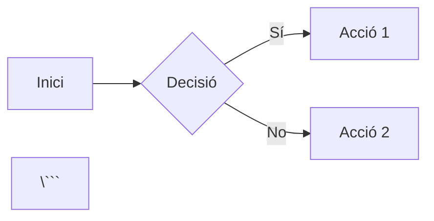

# Instruccions de personalització del template

Aquest document conté instruccions detallades per personalitzar el template de MkDocs per al teu projecte.

## 📋 Taula de continguts

1. [Configuració inicial](#configuració-inicial)
2. [Personalització del lloc](#personalització-del-lloc)
3. [Estructura del contingut](#estructura-del-contingut)
4. [Temes avançats](#temes-avançats)
5. [Publicació](#publicació)

## 🚀 Configuració inicial

### 1. Crear un nou repositori des d'aquest template

1. Fes clic al botó "Use this template" a GitHub
2. Assigna un nom al teu nou repositori
3. Clona el repositori al teu ordinador:
   ```bash
   git clone https://github.com/usuari/nom-repositori.git
   cd nom-repositori
   ```

### 2. Instal·lar les dependències

```bash
pip install -r requirements.txt
```

### 3. Prova que tot funciona

```bash
mkdocs serve
```

Obri el navegador a `http://127.0.0.1:4567` per veure el lloc.

## ⚙️ Personalització del lloc

### Fitxer `mkdocs.yml`

Aquest és el fitxer de configuració principal. Has de modificar les següents línies:

```yaml
site_name: "NOM DEL TEU CURS"          # Canvia pel nom del teu curs
site_author: "EL TEU NOM"              # El teu nom
site_url: https://usuari.github.io/repositori/  # L'URL on es publicarà
repo_name: usuari/repositori           # El nom del teu repositori GitHub
repo_url: https://github.com/usuari/repositori  # L'URL del repositori
```

#### Paleta de colors

Pots canviar els colors del tema modificant la secció `palette`:

```yaml
theme:
  palette:
    - media: "(prefers-color-scheme: light)"
      primary: 'pink'  # Canvia per: red, pink, purple, deep-purple, indigo, blue, light-blue, cyan, teal, green, light-green, lime, yellow, amber, orange, deep-orange
      scheme: default
```

#### Comentaris amb giscus (opcional)

Si vols habilitar comentaris a les pàgines, descomenta i configura la secció `comments`:

1. Activa GitHub Discussions al teu repositori
2. Instal·la [giscus](https://giscus.app/) i obté els teus IDs
3. Actualitza la configuració:

```yaml
theme:
  comments:
    repo: usuari/repositori
    repo_id: TU_REPO_ID
    category: General
    category_id: TU_CATEGORY_ID
    mapping: pathname
    reactions-enabled: true
```

### Fitxer `docs/index.md`

Aquesta és la pàgina principal del teu lloc. Modifica:

```yaml
---
template: document.html
title: Inici
cover:
    title: Títol del teu curs  # Canvia aquest títol
    icon: material/school       # Tria una icona de https://squidfunk.github.io/mkdocs-material/reference/icons-emojis/
hide:
  - navigation
---
```

Després, escriu el contingut de la teua pàgina principal:

- Descripció del curs
- Objectius
- Continguts
- Destinataris
- Avaluació

### Fitxer `docs/informacio.md`

Actualitza la informació sobre el projecte:

- Enllaç al repositori de GitHub
- Llicència (pots canviar-la si vols)
- Dades de l'autor/a
- Informació de contacte

### Portada personalitzada

El fitxer `overrides/partials/cover.html` controla el footer de la portada.

Per afegir logos:

```html



<div class="cover__footer">
    
    
</div>

```

Pots col·locar els teus logos SVG a la carpeta `overrides/img/`.

## 📚 Estructura del contingut

### Organització dels apunts

El contingut principal està a la carpeta `docs/apunts/`. Pots organitzar-lo de diferents formes:

#### Opció 1: Per unitats/blocs

```
docs/apunts/
├── 01_introduccio/
│   ├── index.md
│   ├── teoria.md
│   ├── exercici.md
│   ├── resum.md
│   ├── transparencies.md
│   └── img/
├── 02_fonaments/
│   ├── index.md
│   └── ...
└── 03_avançat/
    ├── index.md
    └── ...
```

#### Opció 2: Per tipus de contingut

```
docs/apunts/
├── teoria/
│   ├── tema1.md
│   └── tema2.md
├── practiques/
│   ├── practica1.md
│   └── practica2.md
└── projectes/
    └── projecte_final.md
```

### Crear una nova unitat

1. Crea una nova carpeta: `docs/apunts/02_nova_unitat/`
2. Crea un fitxer `index.md` amb l'estructura bàsica:

```markdown
---
title: "Unitat 2: Títol de la unitat"
alias: unitat2-index
hide:
  - toc
---

## Unitat 2: Títol de la unitat
Descripció de la unitat.

/// html | div.timeline
**Tema 1**: Descripció del tema 1.
///
/// html | div.timeline
**Tema 2**: Descripció del tema 2.
///
/// html | div.timeline.success.check
**Exercici**: Exercici pràctic d'aquesta unitat.
///
```

3. Afegeix els fitxers de contingut necessaris
4. Actualitza `docs/apunts/index.md` per enllaçar la nova unitat

### Elements especials de Markdown

Aquest template suporta moltes extensions de Markdown. Alguns exemples:

#### Admonitions (caixes de contingut)

```markdown
!!! note "Nota"
    Aquest és un contingut destacat.

!!! tip "Consell"
    Aquest és un consell útil.

!!! warning "Advertència"
    Aquest és un avís important.

!!! example "Exemple"
    Aquest és un exemple.
```

#### Pestanyes

```markdown
=== "Python"
    ```python
    print("Hola món!")
    ```

=== "JavaScript"
    ```javascript
    console.log("Hola món!");
    ```
```

#### Emojis i icones

```markdown
:material-school: :fontawesome-solid-book: :simple-python:
```

Consulta: [Material Icons](https://squidfunk.github.io/mkdocs-material/reference/icons-emojis/)

#### Diagrames Mermaid

```markdown


#### Fórmules matemàtiques

```markdown
Inline: $E = mc^2$

Bloc:
$$
\frac{-b \pm \sqrt{b^2 - 4ac}}{2a}
$$
```

## 🔧 Temes avançats

### Personalitzar els estils CSS

Pots afegir els teus propis estils a `docs/stylesheets/extra.css`.

### Afegir plugins addicionals

Edita `mkdocs.yml` i afegeix plugins a la secció `plugins`.

Alguns plugins útils:

- `minify`: Minifica HTML
- `pdf-export`: Exporta a PDF
- `blog`: Afegeix funcionalitat de blog

### Corrector ortogràfic

El template inclou un corrector ortogràfic en valencià. Per personalitzar-lo, edita `.pyspelling.yml`.

Per afegir paraules personalitzades, edita `hunspell/custom.txt`.

### Templates personalitzats

Pots crear templates HTML personalitzats a la carpeta `overrides/`. Els templates disponibles són:

- `document.html`: Pàgina estàndard de document
- `slides.html`: Presentació de transparències
- `main.html`: Plantilla base

## 🚀 Publicació

### GitHub Pages

1. Al teu repositori GitHub, ves a **Settings** → **Pages**
2. A **Source**, selecciona **GitHub Actions**
3. Cada vegada que faces push a `main`, el lloc es publicarà automàticament

L'URL serà: `https://usuari.github.io/nom-repositori/`

### Publicació manual

Si vols compilar el lloc manualment:

```bash
mkdocs build
```

Això crea la carpeta `site/` amb el lloc web estàtic. Pots pujar-la a qualsevol servidor web.

## 📝 Bones pràctiques

### Estructura de fitxers

- Utilitza noms de fitxer descriptius en minúscules
- Utilitza guions baixos o guions mitjans per separar paraules
- Organitza les imatges en carpetes `img/` dins de cada unitat

### Commits

- Fes commits freqüents amb missatges descriptius
- Utilitza la branca `main` per al contingut definitiu
- Utilitza branques per a desenvolupament de noves funcionalitats

### Actualitzacions

Per actualitzar el tema o els plugins:

```bash
pip install --upgrade -r requirements.txt
```

## 🆘 Solució de problemes

### El lloc no es compila

1. Comprova que totes les referències en `mkdocs.yml` siguen correctes
2. Verifica que tots els fitxers markdown siguen vàlids
3. Revisa els missatges d'error al terminal

### Les imatges no es mostren

1. Comprova que les rutes siguen correctes (relatives al directori `docs/`)
2. Verifica que els fitxers d'imatge existeixen
3. Assegura't que els noms de fitxer no tenen espais

### Els enllaços interns no funcionen

1. Utilitza l'alias definit al frontmatter: `[[alias-pagina]]`
2. O utilitza enllaços relatius: `[text](../altra-pagina.md)`

## 📚 Recursos addicionals

- [MkDocs Documentation](https://www.mkdocs.org/)
- [Material for MkDocs](https://squidfunk.github.io/mkdocs-material/)
- [Python Markdown Extensions](https://python-markdown.github.io/extensions/)
- [PyMdown Extensions](https://facelessuser.github.io/pymdown-extensions/)

## 💡 Consells finals

1. Comença poc a poc, modifica primer els fitxers bàsics
2. Prova els canvis localment amb `mkdocs serve` abans de fer push
3. Consulta la documentació de Material for MkDocs per a funcionalitats avançades
4. No tingues por d'experimentar, sempre pots tornar enrere amb Git!

---

Si tens dubtes o problemes, consulta la documentació oficial o obri una issue al repositori original del template.
