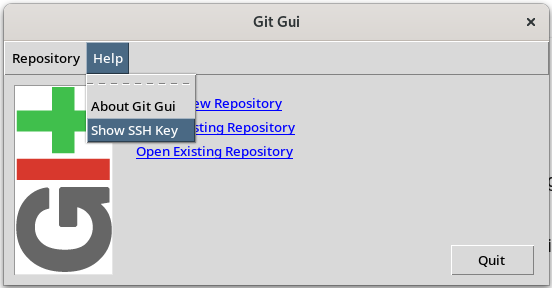
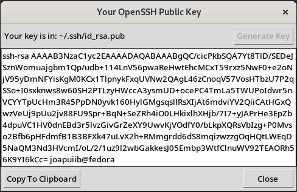

*[IDE]: Integrated Development Environment
*[SSH]: Secure Shell
*[HTTPS]: Hypertext Transfer Protocol Secure
*[PAT]: Personal Access Token

## Mètodes d'autenticació a GitHub
En el blocs anteriors, ens hem centrat en conéixer la seua estructura i
realitzar accions bàsiques per realitzar canvis sobre aquest.

No obstant això, totes les accions que hem realitzat fins ara han sigut
sobre un repositori __local__, és a dir, un repositori que es troba en
el nostre dispositiu i aquests canvis no han segut publicats en cap
lloc.

En aquest bloc, ens centrarem en la creació de repositoris __remots__;
repositoris que es troben __allotjats en un servidor__, que permeten
l'accés a altres usuaris i la col·laboració en el desenvolupament de
projectes. En aquest curs, utilitzarem __[:simple-github: GitHub][github]__ com a
__servidor d'allotjament de repositoris remots__.

[github]: https://github.com/

En aquests apunts ens centrarem en la configuració dels __mètodes d'autenticació__
que ens permeten connectar-nos al servidor de GitHub i gestionar els nostres
repositoris remots.


/// figure-caption
Estructura d'un repositori local i remot
///


## Creació d'un compte a GitHub
Si no en teniu encara, caldrà un compte a [:simple-github: GitHub][github].

> Hi ha persones que prefereixen tindre diferents comptes: un personal i un
> professional. Això depén de les preferències de cadascú.
>
> No obstant això, gestionar l'autenticació de múltiples comptes afegeix
> complexitat addicional.
> A més, cal fixar-se en la [[introduccio#configuracio-git-config|configuració]]
> local i global dels valors `git config user.name` i `git config user.email`.


## Mètodes d'autenticació a GitHub
Per poder enllaçar el teu repositori local amb el repositori remot
i fer canvis en aquest, necessites autenticar-te amb el servidor de GitHub.

!!! recommend
    Per seguretat i fàcil reutilització, es recomana utilitzar el __mètode SSH__ per autenticar-se
    amb el servidor de GitHub.

    Pots consultar l'apartat [Configuració de la clau SSH](#configuracio-de-la-clau-ssh)
    per configurar aquest mètode d'autenticació directament.


GitHub ofereix diferents mètodes d'autenticació,
utilitzant dos protocols de comunicació diferents:

- __Protocol HTTPS__: Utilitza el protocol HTTPS per autenticar-se amb el servidor de GitHub.

    Per utilitzar aquest mètode, has de configurar les teues credencials d'accés a GitHub
    en el teu sistema local.

    Aquesta autenticació es pot realitzar mitjançant:

    - __~~Nom d'usuari i contrasenya~~__: Aquest mètode està
        deshabilitat a GitHub des del 13/08/2021.

    - __Token d'accés personal (*Personal Access Token* o PAT)__:
        GitHub permet crear un token d'accés personal
        per autenticar-se amb el servidor de GitHub.

    - __Extensions de l'IDE__: Alguns Entorns de Desenvolupament Integrats (IDE) inclouen
        extensions que permeten gestionar l'autenticació amb GitHub directament.

- __Protocol SSH__: Utilitza el protocol SSH per autenticar-se amb el servidor de GitHub.

    Per utilitzar aquest mètode, has de configurar una clau SSH en el teu sistema local
    i afegir-la al teu compte de GitHub.


### Token d'accés personal (PAT)
Un __Token d'Accés Personal (*Personal Access Token* o PAT)__ és una clau d'accés
que permet autenticar-se amb el servidor de GitHub mitjançant el protocol HTTPS.

!!! docs
    - [:octicons-link-external-16: Managing your personal access tokens](https://docs.github.com/en/github/authenticating-to-github/keeping-your-account-and-data-secure/creating-a-personal-access-token) – :simple-github: GitHub Docs
    - [:octicons-link-external-16: Message "Support for password authentication was removed."](https://stackoverflow.com/questions/68775869/message-support-for-password-authentication-was-removed) – :simple-stackoverflow: StackOverflow

Per crear un token d'accés personal, segueix els següents passos:

- Inicia la sessió a [:material-github: GitHub](https://github.com/)
- Fes clic a la teua foto de perfil i selecciona __:octicons-gear-16: Settings__.
- A la barra lateral esquerra, fes clic a __:octicons-code-16: Developer settings__.
- A la barra lateral esquerra, fes clic a [__:octicons-key-24: Personal access tokens__.](https://github.com/settings/tokens)
- Fes clic a __Generate new token__.

Existeixen dos tipus de tokens d'accés personal:

- __Access token (classic)__: Permet especificar els permisos que vols donar al _token_,
    que __són globals per a tot el teu compte__.
- __Fine-grained token__: Permet especificar els permisos que vols donar al _token_,
    que __són específics per a un repositori o organització__.

Una vegada creat el _token_, podràs utilitzar-lo per autenticar-te amb el servidor de GitHub.

!!! important
    __Guarda el teu token d'accés personal en un lloc segur.__

    No podràs veure'l de nou després de tancar la pàgina.

Pots utilitzar el teu token d'accés personal per autenticar-te amb el servidor de GitHub
de dues maneres:

- __Mitjançant la URL__: Pots afegir el teu token d'accés personal a la URL del repositori
    per autenticar-te amb el servidor de GitHub.
    ```shellconsole
    git clone https://<token>@github.com/<usuari>/<repositori>
    ```
- __Mitjançant la contrasenya__: Pots utilitzar el teu token d'accés personal com a contrasenya
    per autenticar-te amb el servidor de GitHub.

    !!! note
        Per seguretat, no es mostrarà res en el camp de la contrasenya
        quan l'introduïsques.

    ```shellconsole
    jpuigcerver@fp:~ $ git clone https://github.com/<usuari>/<repositori>
    Cloning into '<repositori>'...
    Username for 'https://github.com': <usuari>
    Password for 'https://<username>@github.com': <token>
    ```


!!! tip
    Per tal de no haver de recordar el PAT cada vegada, és possible configurar
    Git perquè ho recorde automàticament.

    ```bash
    git config --global credential.helper store
    ```
    Aquesta comanda guardarà les credencials en un __fitxer de text pla__ en el teu sistema local,
    concretament en el fitxer `~/.git-credentials`.


### Autenticació mitjançant claus SSH
Per autenticar-te amb el servidor de GitHub mitjançant el protocol SSH,
has de configurar una clau SSH en el teu sistema local i afegir-la al teu compte de GitHub.

!!! important
    Aquesta configuració s'ha de repetir per cada dispositiu on
    vulgues utilitzar aquest mètode d'autenticació.

!!! docs
    [:octicons-link-external-16: Connecting to GitHub with SSH](https://docs.github.com/en/github/authenticating-to-github/connecting-to-github-with-ssh) – :simple-github: GitHub Docs

#### Generació de la clau SSH
Per generar una clau SSH, segueix els següents passos:

=== "Interfície gràfica"

    - Obri el programa [__Git GUI__](https://git-scm.com/downloads/guis).

        > A :material-microsoft-windows: Windows, el programa ve inclòs
        > amb la instal·lació de Git.

    - Obri el diàleg a __Help > Show SSH Key__.

        
        /// caption
        Menú diàleg SSH de Git GUI
        ///

    - Fes clic a __Generate Key__.
        - Opcionalment, indica una contrasenya (_passphrase_) per protegir la clau
            o deixa el camp buit per no protegir-la.

    - Fes clic a __Copy to Clipboard__ per copiar la clau pública al porta-retalls.

        
        /// caption
        Clau SSH generada amb Git GUI
        ///


=== "Terminal"
    - __Crea una clau SSH__ al teu sistema local mitjançant la comanda __`ssh-keygen`__.

        ```shellconsole
        jpuigcerver@fp:~ $ ssh-keygen -t rsa -b 4096
        Generating public/private rsa key pair.
        Enter file in which to save the key (/home/jpuigcerver/.ssh/id_rsa):
        Enter passphrase (empty for no passphrase):
        Enter same passphrase again:
        Your identification has been saved in /home/jpuigcerver/.ssh/id_rsa
        ```

        - `-t rsa`: Indica el tipus de clau RSA.
        - `-b 4096`: Indica la longitud de la clau en bits.
        - Pots indicar la ruta on guardar la clau. Per defecte, es guarda en `/home/<usuari>/.ssh/id_rsa`.
        - Pots indicar una contrasenya per protegir la clau. Si no vols protegir-la, deixa el camp buit.

    - Còpia el contingut de la __clau pública__ (`id_rsa.pub`) al porta-retalls.

        ```shellconsole
        jpuigcerver@fp:~ $ cat ~/.ssh/id_rsa.pub
        ssh-rsa AAAAB3NzaC1yc2EAAAADAQABAAACAQC7GqFnEFQZK4+l3zvXF07hN/cMk5ZtJmMkHWAJyTYQ+pDwMXp9eQs
        +VASLlz9z+0Q3vnnXN4vBO/+2u29fKJ4YlrecDYtCDpEhMXCkaCv9/ggkru09j2rELFuAqER55lgEtRKTfLKAVFa3Ws
        2VV7zlTSAH2y8nVddzlJRE9Y1BAfH0+1hjpCe+vgGObBLyIGGsXwlmm3mwI7NKHuKCIVskIEX3F0jw668dBex+6VUtG
        ...
        ```


#### Configuració de la clau SSH
Després, configura la clau SSH al teu compte de
:simple-github: GitHub seguint els següents passos:

- Inicia la sessió a [:material-github: GitHub][github].
- Fes clic a la teua foto de perfil i selecciona __:octicons-gear-16: Settings__.
- A la barra lateral esquerra, fes clic a [:octicons-key-24: __SSH and GPG keys__](https://github.com/settings/keys).
- Fes clic a __New SSH key__.
    - Indica un títol per a la clau SSH.
    - Enganxa el contingut de la clau pública al camp __Key__.

#### Comprovació de l'autenticació
Per comprovar que la clau SSH s'ha configurat correctament,
executa la següent comanda en el terminal:

```bash
ssh -T git@github.com
```

En cas que la clau SSH estiga configurada correctament,
el terminal mostrarà un missatge amb el nom el
teu nom d'usuari de GitHub.

```shellconsole
jpuigcerver@fp:~ $ ssh -T git@github.com
Hi joapuiib! You've successfully authenticated, but GitHub does not provide shell access.
```


### Autenticació mitjançant :simple-github: GitHub CLI
[:simple-github: GitHub CLI][github-cli] és una eina de línia de comandes
per interactuar amb GitHub des del terminal. Permet gestionar repositoris,
issues, pull requests, i altres funcionalitats de GitHub.

[github-cli]: https://cli.github.com/

Una de les funcionalitats que ofereix és la possibilitat d'autenticar-se
amb el servidor de GitHub d'una manera senzilla i flexible.

!!! docs "Documentació oficial"
    - [:octicons-link-external-16: Instal·lació](https://github.com/cli/cli#installation) – :simple-github: GitHub CLI
    - [:octicons-link-external-16: `gh auth login`](https://cli.github.com/manual/gh_auth_login) – :simple-github: GitHub CLI Docs

La manera més senzilla d'autenticar-se amb GitHub és mitjançant la comanda `gh auth login`,
que guia l'usuari d'una manera interactiva com configurar l'autenticació.

```shellconsole
jpuigcerver@fp:~ $ gh auth login
? What account do you want to log into? GitHub.com
? What is your preferred protocol for Git operations on this host? HTTPS
? Authenticate Git with your GitHub credentials? Yes
? How would you like to authenticate GitHub CLI? Login with a web browser

! First copy your one-time code: ABCD-EFGH
Press Enter to open github.com in your browser... 

✓ Authentication complete. You are now logged in as joapuiib
```


## Bibliografia
- [:octicons-link-external-16: :simple-git: Pro Git Book](https://git-scm.com/book/en/v2)
- [:octicons-link-external-16: Message "Support for password authentication was removed."](https://stackoverflow.com/questions/68775869/message-support-for-password-authentication-was-removed) – :simple-stackoverflow: StackOverflow
- [:octicons-link-external-16: Managing your personal access tokens](https://docs.github.com/en/github/authenticating-to-github/keeping-your-account-and-data-secure/creating-a-personal-access-token) – :simple-github: GitHub Docs
- [:octicons-link-external-16: Connecting to GitHub with SSH](https://docs.github.com/en/github/authenticating-to-github/connecting-to-github-with-ssh) – :simple-github: GitHub Docs
