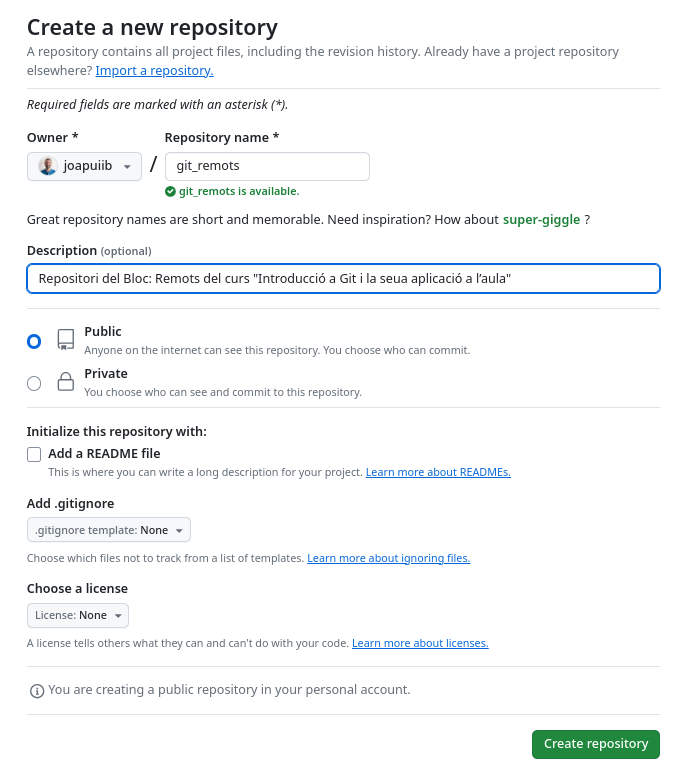
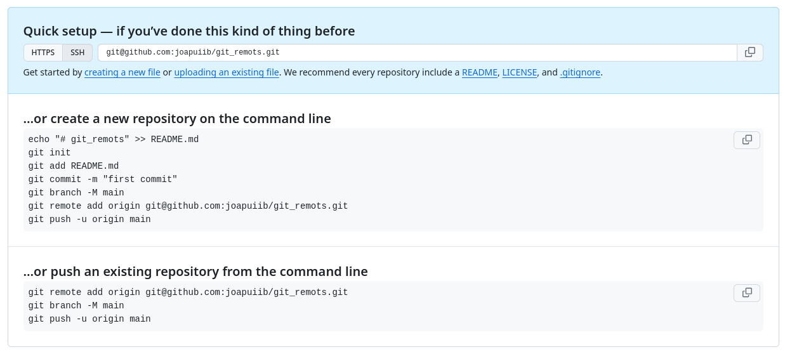
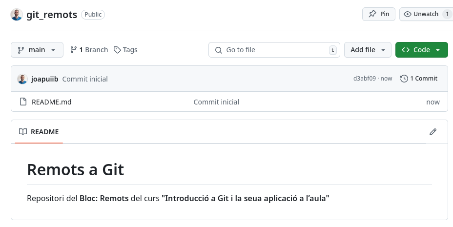
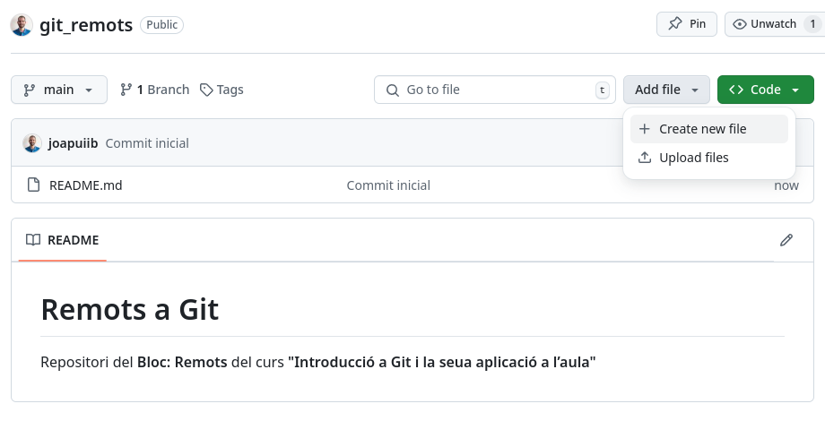
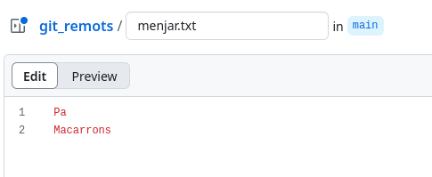
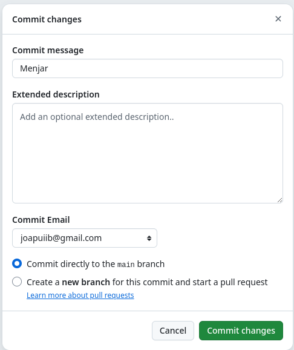
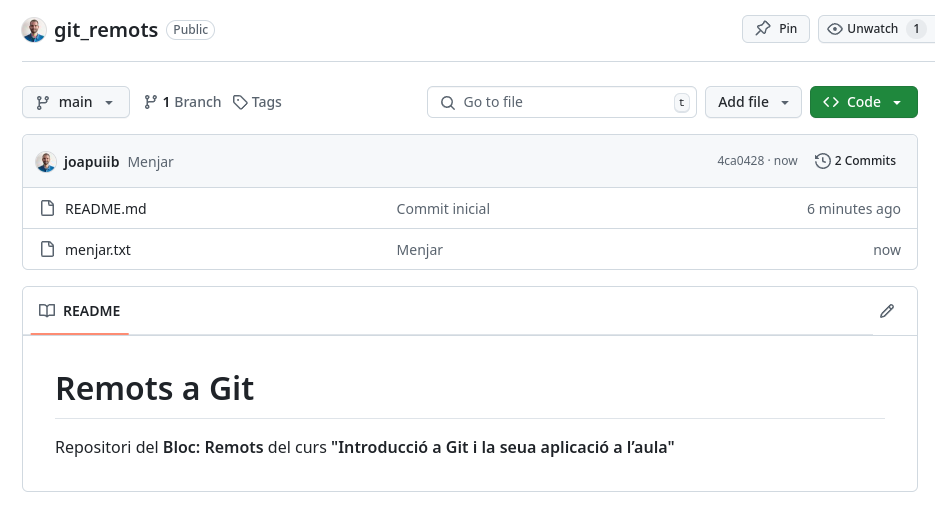

*[PAT]: Personal Access Token

## Introducció
En el blocs anteriors, ens hem centrat en conéixer la seua estructura i
realitzar accions bàsiques per realitzar canvis sobre aquest.

No obstant això, totes les accions que hem realitzat fins ara han sigut
sobre un repositori __local__, és a dir, un repositori que es troba en
el nostre dispositiu i aquests canvis no han segut publicats en cap
lloc.

En aquest bloc, ens centrarem en la creació de repositoris __remots__;
repositoris que es troben __allotjats en un servidor__, que permeten
l'accés a altres usuaris i la col·laboració en el desenvolupament de
projectes.


/// figure-caption
Estructura d'un repositori local i remot
///

??? prep "Preparació repositori local"
    En aquests apunts treballarem sobre un nou repositori local.

    !!! danger
        Crea el nou repositori __en una carpeta independent__ per evitar
        problemes amb els exemples i exercicis anteriors.

    __Inicialització:__
    ```bash
    --8<-- "docs/files/remots/stdout/remots/setup_remots.sh"
    ```

    ```shellconsole
    --8<-- "docs/files/remots/stdout/remots/inicial.txt"
    ```

    1. Canviem el nom de la branca principal a `main`.

    ```md title="README.md"
    --8<-- "docs/files/remots/stdout/remots/README.txt"
    ```


## Repositori remot
Un __Repositori Remot__ és una còpia d'un repositori de Git que es troba allotjat en un servidor
o en un altre lloc fora del teu propi sistema local.
Aquesta còpia conté una rèplica completa de la història del repositori,
incloses totes les revisions i les branques.
Els repositoris remots permeten la col·laboració i el seguiment del desenvolupament del codi
entre múltiples persones, o tu mateix en diferents dispositius.


/// figure-caption
Repositori remot vinculat a múltiples repositoris locals
///

Entre les finalitats dels repositoris remots podem trobar:

- __Col·laboració__: Permeten que diversos desenvolupadors treballen junts en un mateix projecte.
    Cada desenvolupador pot treballar en la seua còpia local del repositori remot i,
    una vegada fetes les seues modificacions, pot pujar els canvis al repositori remot perquè altres membres
    de l'equip puguen veure i incorporar aquestes modificacions.
- __Còpia de seguretat__: Un repositori remot pot servir com a còpia de seguretat del teu projecte.
    Si el teu sistema local es danya o es perd, encara tindràs accés a la teua història completa
    i als fitxers del projecte mitjançant el repositori remot.
- __Distribució__: Els repositoris remots permeten distribuir el teu codi a altres llocs.
    Això pot ser útil per compartir el teu codi amb altres persones
    o per desplegar el teu projecte en un servidor en línia.

Gràcies a aquestes característiques, Git s'ha convertit en una eina clau en qualsevol desenvolupament,
però sobretot en __els projectes de codi obert__ (_open source_), ja que permet la col·laboració
de desenvolupadors de tot el món en un mateix projecte de manera senzilla i distribuïda.

## Allotjament de repositoris remots
Els repositoris remots es poden allotjar en qualsevol màquina o __servidor dedicat__.
No obstant això, hi ha serveis d'allotjament de repositoris remots en línia que faciliten la creació
i la gestió de repositoris remots.

Alguns dels serveis d'allotjament repositoris remots en línia més coneguts són:

- __[:simple-github: GitHub](https://github.com/)__: Servei d'allotjament de repositoris creat en 2008 i adquirit per Microsoft en 2018.
    És el servei d'allotjament de repositoris de Git més utilitzat.

    Ofereix una opció gratuïta, que permet crear projectes públics i privats, però amb algunes restriccions.
    També ofereix plans de pagament per projectes empresarials.

- __[:simple-gitlab: GitLab](https://gitlab.com/)__: Servei d'allotjament de repositoris. GitLab és una plataforma de codi obert.
- __[:simple-bitbucket: Bitbucket](https://bitbucket.org/)__: Servei d'allotjament de repositoris propietat de l'empresa Atlassian,
    s'integra estretament amb altres eines d'aquesta empresa, com Jira.

!!! info "Més informació"
    [:octicons-link-external-16: GitLab vs. GitHub: Which is Better in 2025?](https://prismic.io/blog/gitlab-vs-github#similarities-between-github-and-gitlab) – :simple-prismic: prismic Blog
    { .spell-ignore }


## Creació d'un repositori remot a GitHub
En aquesta secció, crearem un repositori remot a GitHub.

1. Crea un compte a [:simple-github: GitHub](https://github.com/) si no en tens un.
2. Inicia la sessió amb el teu compte.
3. Fes clic al botó __[:octicons-repo-24: New](https://github.com/new)__ per crear un nou repositori.
4. Omple el formulari amb la informació del teu repositori:
    - __Nom__ del repositori. Ha de ser un nom únic en el teu compte de GitHub.
    - __Descripció__ del repositori. Opcional.
    - __Visibilitat__ del repositori. Pots triar entre públic o privat.
        - __:octicons-repo-24: Públic__: Qualsevol persona pot veure el teu repositori. Sols les persones autoritzades poden fer canvis.
        - __:octicons-lock-24: Privat__: Només tu i les persones que tu autoritzes poden veure el teu repositori. Sols les persones autoritzades poden fer canvis.
    - __README__: Indica si vols afegir un README al teu repositori.
    - __.gitignore__: Indica si vols afegir un fitxer `.gitignore` per ignorar fitxers en el teu repositori.
    - __Llicència__: Indica si vols afegir una llicència al teu repositori.

??? example "Exemple: Creació d'un repositori a GitHub"
    Creem un repositori amb les següents característiques:

    - __Nom__: `git_remots`
    - __Descripció__: Repositori del Bloc: Remots del curs "Introducció a Git i la seua aplicació a l’aula"
    - __Visibilitat__: Públic
    - __README__: No
    - __.gitignore__: No
    - __Llicència__: No

    
    /// figure-caption
    Formulari de creació d'un nou repositori a GitHub
    ///

    Una vegada omplert el formulari, fes clic a __"Create repository"__ per crear el teu repositori.

    El teu repositori s'hauria de crear __buit__ i hauries de veure una pàgina com la següent:

    
    /// figure-caption
        attrs: { id: figure-create-github-repo }
    Repositori buit creat a GitHub
    ///

    La [Figura 3](#figure-create-github-repo) mostra els passos per enllaçar el teu repositori local amb el repositori remot creat a GitHub.
    En els següents apartats, explicarem aquestes ordres amb més detall.


## Configurar un repositori remot (`git remote`)
El primer pas és enllaçar el teu __Repositori Local__
amb el __Repositori Remot__ que acabem de crear.
Per fer-ho, utilitzarem la comanda `git remote`.

La comanda `git remote` permet gestionar els repositoris remots
associats al teu repositori local.

La sintaxi és la següent:
```bash
git remote [add|rename|remove|show] [<options>]
```

Aquesta comanda permet realitzar les següents accions:

- __Sense opcions__: Mostra els repositoris remots associats al teu repositori local.
- __`add`__: Afegeix un nou repositori remot.
- __`rename`__: Canvia el nom d'un repositori remot.
- __`remove`__: Elimina un repositori remot.
- __`show`__: Mostra informació detallada d'un repositori remot.

Cadascuna d'aquestes opcions té les seues pròpies opcions i arguments.

!!! docs "Documentació oficial de :simple-git: Git"
    [:octicons-link-external-16: `git remote`](https://git-scm.com/docs/git-remote)

### Afegir un repositori remot
Per afegir un repositori remot, utilitzarem la comanda `git remote add`.

La sintaxi és la següent:
```bash
git remote add <alies> <url>
```

- `<alies>`: Nom o àlies del repositori remot en el teu repositori local.
    Normalment, s'utilitza el nom `origin` per referir-se al repositori remot principal.
- `<url>`: URL del repositori remot.


/// figure-caption
Repositori Local vinculat amb un Repositori Remot
///

!!! warning annotate
    Si intentes publicar amb `git push`
    els canvis en un repositori remot
    sense haver enllaçat el teu repositori local,
    Git et mostrarà un missatge d'error:

    ```shellconsole
    --8<-- "docs/files/remots/stdout/remots/no_remote.txt"
    ```

??? example annotate "Exemple: Afegir un repositori remot"
    Enllaçarem el nostre repositori local amb el repositori
    remot creat anteriorment a GitHub.

    La URL del repositori remot és `git@github.com:jpuigcerver/git_remots.git`.
    
    > Utilitzem la URL __SSH__ ja que he decidit utilitzar aquest mètode d'autenticació.

    ```shellconsole
    --8<-- "docs/files/remots/stdout/remots/add_remote.txt"
    ```


### Reanomenar un repositori remot
L'ordre `git remote rename` permet canviar el nom
d'un repositori remot associat al teu repositori local.

La sintaxi és la següent:
```bash
git remote rename <antic> <nou>
```

- `<antic>`: Àlies actual del repositori remot.
- `<nou>`: Nou àlies del repositori remot.

### Eliminar un repositori remot
L'ordre `git remote remove` permet eliminar un repositori remot
associat al teu repositori local.

La sintaxi és la següent:
```bash
git remote remove <alies>
```

- `<alies>`: Àlies del repositori remot a eliminar.


## Publicació de canvis (`git push`)
De moment, les branques que hem creat resideixen en el repositori local,
és a dir, en el nostre dispositiu.

Podem publicar la branca i els seus canvis al repositori remot
mitjançant l'ordre `git push`.

```bash
git push [-u|--set-upstream] [<remot> [<branca>]]
```

- `-u|--set-upstream`: Configura la branca local perquè s'associe amb la branca remota.
- `<remot>`: Àlies del repositori remot (configurat amb `git remote add`).
- `<branca>`: Nom de la branca remota.

!!! docs "Documentació oficial de :simple-git: Git"
    [:octicons-link-external-16: `git push`](https://git-scm.com/docs/git-push)

!!! important
    Aquesta comanda funciona sobre la branca on estem situats (`HEAD`).


/// figure-caption
Publicació d'una branca local a una branca remota
///

??? example "Exemple: Publicació i associació branca local i remota"
    Vegem que inicialment la branca `main` no està associada a cap branca remota.

    Si intentem fer un `git push`, ens mostrarà un missatge d'error com que
    hem d'anar associar una branca remota.

    ```shellconsole
    --8<-- "docs/files/remots/stdout/remots/push_no_upstream.txt"
    ```

    Associem les branques `main` local i remota amb l'ordre `git push --set-upstream`.

    Localment, s'ha creat la referència `origin/main` que apunta a la branca remota `main`.


    ```shellconsole
    --8<-- "docs/files/remots/stdout/remots/push_upstream.txt"
    ```

    Vegem que els canvis s'han publicat correctament al repositori remot:

    
    /// figure-caption | ^1
        attrs: {class: "shadow"}
    Canvis publicats a :material-github: GitHub
    ///


### Associació de branques locals i remotes
Les branques locals poden ser associades a branques remotes
mitjançant l'opció `-u` o `--set-upstream` de la comanda `git push`.

```
git push [-u | --set-upstream] <remot> <branca>

Aquesta associació li permet a Git saber sobre quina branca remota
ha de realitzar les operacions quan no s'especifica explicitament,
com ara `git pull` o `git push`.

!!! tip
    Pots configurar git perquè configure automàticament la branca local
    perquè s'associe amb la branca remota amb el mateix nom
    amb l'opció `push.autoSetupRemote`.

    ```bash
    git config --global push.autoSetupRemote true
    ```

L'associació d'una branca local pot ser eliminada
mitjançant l'ordre `git branch --unset-upstream`.

```bash
git branch --unset-upstream [<branca>]
```


## Clonació d'un repositori remot (`git clone`)
L'ordre `git clone` permet copiar un repositori remot a un repositori local en el teu sistema,
des del qual podràs realitzar canvis.

Aquesta ordre còpia els continguts del _Directori de Treball_ i tota la informació del _Repositori Local_,
incloent la història de canvis. A més, configura automàticament el repositori remot com a `origin`.

La sintaxi és la següent:
```bash
git clone <url> [<directori>]
```

- `<url>`: URL del repositori remot. Pot ser una URL HTTPS o SSH.
- `<directori>`: Opcional. Nom del directori on es copiarà el repositori. Per defecte, es crea un directori amb
    el nom del repositori remot.


/// figure-caption
Clonació d'un repositori remot
///

??? example "Exemple: Clonació d'un repositori remot"
    Com que ja tenim els canvis publicats al repositori remot,
    podem clonar el repositori remot al nostre sistema local.

    Esborrem el directori `git_remots` i el clonarem des del repositori remot.


    ```shellconsole
    --8<-- "docs/files/remots/stdout/remots/clone.txt"
    ```

    S'observa que s'ha clonat correctament el repositori remot `git_remots`
    que conté els fitxers i la història de canvis del repositori remot.


## Sincronització entre repositoris (`git fetch`)


L'ordre `git fetch` actualitza la informació de les branques remotes `origin/<branca>`
al nostre repositori local, però no aplica els canvis a les nostres branques locals.

```bash
git fetch [<options>] [<remot>]
```

- `<options>`: Opcions de la comanda.
- `<remot>`: Àlies del repositori remot. Per defecte, s'utilitza `origin`.


/// figure-caption
Sincronització entre repositoris amb `git fetch`
///


Aquesta ordre és útil per obtindre la informació dels canvis realitzats en el repositori remot
i decidir si volem incorporar-los al nostre repositori local.

!!! docs "Documentació oficial de :simple-git: Git"
    [:octicons-link-external-16: `git fetch`](https://git-scm.com/docs/git-fetch)

!!! info
    L'opció `--prune` permet eliminar les referències de les branques remotes que ja no existeixen
    en el repositori remot.

    Aquesta opció pot ser configurada per defecte amb la comanda `git config`.

    ```bash
    git config --global fetch.prune true
    ```

    També es pot configurar perquè aquesta opció s'aplique en la comanda `git pull`.

    ```bash
    git config --global remote.origin.prune true
    ```

??? prep "Preparació: Canvis en el repositori remot"
    Anem a realitzar un canvi en el repositori remot directament a :material-github: GitHub.

    1. Creem un fitxer `menjar.txt` amb el contingut:

        ```plaintext title="menjar.txt"
        Pa
        Macarrons
        ```

    
    /// figure-caption | ^1
    Crear un nou fitxer a :material-github: GitHub
    ///

    
    /// figure-caption | ^1
    Afegir contingut a `menjar.txt` en :material-github: GitHub
    ///

    2. Creem un _commit_ amb el missatge __Menjar__.

    
    /// figure-caption | ^1
    Crear un commit a :material-github: GitHub
    ///

    3. Comprovem que el canvi s'ha realitzat correctament.

    
    /// figure-caption | ^1
    Canvi realitzat a :material-github: GitHub
    ///


??? example "Exemple: Sincronització entre repositoris (`fetch`)"
    En aquest moment, s'ha realitzat un canvi en el repositori remot,
    que no figura en el nostre repositori local.

    ```shellconsole
    --8<-- "docs/files/remots/stdout/remots/before_fetch.txt"
    ```

    Sincronitzem el repositori local amb el repositori remot,
    que conté els nous canvis realitzats.
    
    ```shellconsole
    --8<-- "docs/files/remots/stdout/remots/after_fetch.txt"
    ```

    S'observa que la branca `origin/main` s'ha actualitzat amb el nou canvi,
    però la branca local `main` no s'ha modificat.


## Incorporació de canvis (`git pull`)
Per incorporar els canvis d'una branca remota a la branca local,
utilitzarem l'ordre `git pull`.

Aquesta ordre realitza dos accions:

- `git fetch`: Actualitza la informació de les branques remotes al nostre repositori local.
- `git merge origin/<branca>`: Incorpora els canvis de la branca remota a la branca local.


/// figure-caption
Incorporació de canvis amb `git pull`
///

La sintaxi és:

```bash
git pull [<options>] [<remot> [<branca>]]
```

- `<options>`: Opcions de la comanda.
- `<remot>`: Àlies del repositori remot. Per defecte, s'utilitza la [branca remota associada][associada] a la branca actual.
- `<branca>`: Nom de la branca remota. Per defecte, s'utilitza la [branca remota associada][associada] a la branca actual.

[associada]: #associacio-de-branques-locals-i-remotes

!!! docs "Documentació oficial de :simple-git: Git"
    [:octicons-link-external-16: `git pull`](https://git-scm.com/docs/git-pull)

!!! warning
    La fusió (`merge`) implícita de `git pull` pot ser una [[branques#fusio-directa]]
    o es pot produir una [[branques#fusio-de-branques-divergents]] si
    la branca local i la branca remota divergeixen.

    En aquest últim cas:

    - __Poden produir conflictes__. Si es produeixen, caldrà resoldre'ls manualment.
    - Executar directament `git pull` __generarà un commit de fusió__,
        que pot ser no és desitjable si es vol mantenir __una història lineal__.
    
!!! tip
    Per evitar __la fusió de branques divergents__ en `git pull`,
    es pot fer el següent:

    - `git pull --ff-only`: Incorpora els canvis de la branca remota
        __només si es pot fer una fusió directa (_fast-forward_)__.

        En cas contrari, es produirà un error i no s'incorporaran els canvis.

        A més, Git pot ser configurat perquè incloga aquesta opció
        en la comanda `git pull`.

        ```
        git config --global pull.ff only
        ```

    - `git pull --rebase`: Incorpora els canvis de la branca remota
        mitjançant un `rebase`, és a dir, aplica els canvis de la branca local
        després dels canvis de la branca remota.
        { #git-pull-rebase }

        Aquest comportament també es pot configurar per defecte en la comanda `git pull`.

        ```
        git config --global pull.rebase true
        ```

??? example "Exemple: Incorporació de canvis fusió directa (`pull --ff-only`)"
    Vegem com el commit `1b3b4b0` forma part de la branca remota `origin/main`,
    però no de la branca local `main`.

    ```shellconsole
    --8<-- "docs/files/remots/stdout/remots/before_pull_ff.txt"
    ```

    Incorporem els canvis de la branca remota `origin/main` a la branca local `main`.

    ```shellconsole
    --8<-- "docs/files/remots/stdout/remots/after_pull_ff.txt"
    ```

??? prep "Preparació: Més canvis en el repositori remot"
    Realitza els següents canvis en el repositori remot directament a :material-github: GitHub.

    - Modifica el fitxer `menjar.txt` amb el següent contingut:

        ```plaintext title="menjar.txt"
        Pa
        Macarrons
        Pomes
        ```

    - Crea un _commit_ amb el missatge __Més menjar__.

??? example annotate "Exemple: Incorporació de canvis amb fusió de branques divergents (`pull --no-ff` i `pull --rebase`)"

    Una de les situacions més comunes que ens porten a que la branca local divergisca de la branca remota és
    quan realitzem canvis sobre la branca local sense haver sincronitzat abans el seu estat amb la branca remota associada.

    En aquest cas, s'ha realitzat un altre canvi en el repositori remot,
    que nosaltres no hem incorporat.

    No obstant això, anem a fer un canvi a la branca local `main`,
    simulant la situació anteriorment descrita.

    ```shellconsole
    --8<-- "docs/files/remots/stdout/remots/prepare_local_pull_no_ff.txt"
    ```

    1. El canvi __Més menjar__ no està reflectit en la branca remota `origin/main`
    perquè no hem sincronitzat el nostre repositori local amb el repositori remot.


    En aquest moment, podríem intentar publicar aquest canvi al repositori remot,
    però com que el repositori remot té canvis que no estan reflectits en el nostre repositori local,
    Git ens mostrarà un missatge d'error.

    ```shellconsole
    --8<-- "docs/files/remots/stdout/remots/pull_no_ff_push_error.txt"
    ```

    Vegem que l'ordre `git push` ens recomana fer un `git pull` per incorporar els canvis,
    ja que les dues branques __han divergit__.

    Si executem `git pull`, es produirà una fusió de branques divergents, que crearà un commit de fusió
    i resultarà en una història no lineal.

    Vegem que no podem incorporar els canvis amb una fusió directa `git pull --ff-only`.

    ```shellconsole
    --8<-- "docs/files/remots/stdout/remots/pull_ff_only_error.txt"
    ```

    En aquest cas, haurem d'incorporar els canvis de dues maneres diferents.

    !!! warning "Un _commit_ de fusió: `git pull --no-ff`."
        Aquest és el procés que seguirà `git pull` si no
        indiquem cap opció addicional.

        En aquest cas crearà un commit de fusió,
        que no és desitjable si es vol mantenir una història lineal.

        ```shellconsole
        --8<-- "docs/files/remots/stdout/remots/pull_no_ff.txt"
        ```

        1. L'opció `--no-edit` indica que no volem editar el missatge de commit de fusió i deixem el missatge per defecte.

    !!! recommend "Un canvi de base: `git pull --rebase`."
        Aquesta opció aplica els canvis de la branca local després dels canvis de la branca remota,
        mantenint una història lineal.

        ```shellconsole
        --8<-- "docs/files/remots/stdout/remots/pull_rebase.txt"
        ```


/// html | div.spell-ignore
## Recursos addicionals
- [:simple-youtube: Curs de Git des de zero](https://www.youtube.com/watch?v=3GymExBkKjE&ab_channel=MoureDevbyBraisMoure) per [Moure Dev](https://www.youtube.com/@mouredev)
- [:octicons-link-external-16: Learn `git` concepts, not commands](https://github.com/UnseenWizzard/git_training) per [@UnseenWizzard](https://github.com/UnseenWizzard)


## Bibliografia
- [:octicons-link-external-16: :simple-git: Pro Git Book](https://git-scm.com/book/en/v2)
- [:octicons-link-external-16: Learn `git` concepts, not commands](https://github.com/UnseenWizzard/git_training) per [@UnseenWizzard](https://github.com/UnseenWizzard)
///
