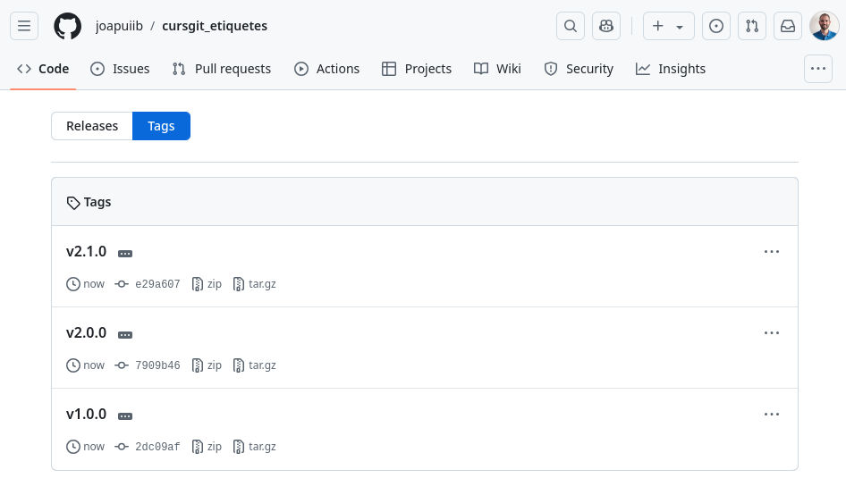

## Etiquetes
En Git, tots els commits estan identificats mitjançant un _hash_, que es un identificador alfanumèric que es genera quan creem un _commit_.
No obstant això, de vegades és útil identificar punts concrets (_commits_) en l'estat del nostre repositori amb un nom és més fàcil i significatiu que un _hash_.

Per aquesta raó, Git ens permet crear __etiquetes__ (_tags_) per a marcar punts concrets en la història del nostre repositori.

Normalment, en projectes de desenvolupament, les etiquetes s'utilitzen per identificar noves publicacions (_releases_): `v1.0`, `v2.0`, ...,
però poden ser utilitzades per qualsevol propòsit.


/// figure-caption
Etiqueta a un commit
///

Hi ha dos tipus d'etiquetes, les __etiquetes lleugeres__ i les __etiquetes anotades__.

- Una __etiqueta lleugera__ és una referència alfanumèrica que s'especifica a un commit.
- Una __etiqueta anotada__ és un objecte de Git que, a més, conté qui ha creat l'etiqueta, la data de creació i un missatge.

!!! docs "Documentació oficial de :simple-git: Git"
    - [:octicons-link-external-16: `git tag`](https://git-scm.com/docs/git-tag)
    - [:octicons-link-external-16: Capítol 2.6 Git Basics - Tagging](https://git-scm.com/book/en/v2/Git-Basics-Tagging) – [:simple-git: Pro Git Book](https://git-scm.com/book/en/v2)

??? prep "Preparació repositori"

    !!! danger
        Crea el nou repositori __en una carpeta independent__ per evitar
        problemes amb els exemples i exercicis anteriors.

    !load_file "avancat/stdout/etiquetes/setup_tags.sh"

    ```shellconsole
    --8<-- "docs/files/avancat/stdout/etiquetes/setup_tags.txt"
    ```


### Numeració de versions
En projectes de desenvolupament, és comú utilitzar un sistema de numeració de versions
per identificar les diferents versions del software.

Una bona pràctica és utilitzar el sistema de numeració semàntica,
que permet identificar de forma clara i senzilla els canvis que s'han realitzat en cada versió.

El sistema de numeració semàntica __[:octicons-link-external-16: SemVer](https://semver.org/lang/ca/)__ especifica el següent format per a les versions:

```
MAJOR.MINOR.PATCH
```

1. `MAJOR`: Cal incrementar aquest comptador quan es realitzen canvis incompatibles amb versions anteriors.
2. `MINOR`: Cal incrementar aquest comptador quan s'afegeixen funcionalitats compatibles amb versions anteriors.
3. `PATCH`: Cal incrementar aquest comptador quan es realitzen correccions de bugs compatibles amb versions anteriors.

??? example "Exemple: Numeració de versions"
    La versió `1.2.0` indica:

    - `1`: Versió major.
    - `2`: Versió menor.
    - `0`: Versió de correcció de bugs.

    Si en aquest punt es realitza una addició de funcionalitats compatibles amb versions anteriors, la versió següent seria `1.3.0`.

    Després, si es realitzen correccions de bugs compatibles amb versions anteriors, la versió següent seria `1.3.1`.

    En canvi, si es realitzen canvis incompatibles amb versions anteriors, la versió següent seria `2.0.0`.

### Creació d'etiquetes
L'ordre `git tag` ens permet crear etiquetes lleugeres o anotades.

La sintaxi és la següent:
```bash
git tag [-a] <nom_etiqueta> [-m "missatge"] [<ref>]
```

- `-a`: Crea una etiqueta anotada. Si no s'especifica, es crea una etiqueta lleugera.
- `<nom_etiqueta>`: Nom de l'etiqueta.
- `-m "missatge"`: Missatge de l'etiqueta anotada. Si no s'especifica, s'obrirà un editor per escriure el missatge.
- `<ref>`: Referència al commit al qual volem associar l'etiqueta. Si no s'especifica, es crea en el commit actual (`HEAD`).

!!! docs "Documentació oficial de :simple-git: Git"
    [:octicons-link-external-16: `git tag`](https://git-scm.com/docs/git-tag)

??? example "Exemple: Creació d'etiqueta anotada"
    S'han creat la etiquetes anotades:

    - `v1.0.0` en el primer commit, amb el missatge `Primera versió: v1.0.0`.
    - `v2.0.0` en el commit __README: Apartat tipus etiquetes__, amb el missatge `Versió: v2.0.0`.

    ```shellconsole
    --8<-- "docs/files/avancat/stdout/etiquetes/etiqueta_anotada.txt"
    ```

??? example "Exemple: Creació d'etiqueta lleugera"
    S'han creat la etiquetes lleugeres:

    - `v1.1.0` en el _commit_ __README: Descripció__.
    - `v2.1.0` en el _commit_ actual.

    ```shellconsole
    --8<-- "docs/files/avancat/stdout/etiquetes/etiqueta_lleugera.txt"
    ```

### Llistar etiquetes
L'ordre `git tag` sense arguments ens permet llistar les etiquetes del nostre repositori.

```bash
git tag [-l | --list] [<patró>]
```

- `-l` o `--list`: Llista les etiquetes.
- `<patró>`: Patró per filtrar les etiquetes que permeten [caràcters comodí (wildcards)](https://en.wikipedia.org/wiki/Wildcard_character).

!!! docs "Documentació oficial de :simple-git: Git"
    [:octicons-link-external-16: `git tag --list`](https://git-scm.com/docs/git-tag)

??? example "Exemple: Llistar etiquetes"
    Mostrem les etiquetes del nostre repositori.

    ```shellconsole
    --8<-- "docs/files/avancat/stdout/etiquetes/llista.txt"
    ```

??? example "Exemple: Llistar etiquetes amb patró"
    Mostrem les etiquetes del nostre repositori que comencen per `v2.`.

    ```shellconsole
    --8<-- "docs/files/avancat/stdout/etiquetes/llista_patro.txt"
    ```

### Consultar informació d'una etiqueta
L'ordre `git show` ens permet consultar la informació d'una etiqueta.

```bash
git show <nom_etiqueta>
```

- En cas de les __etiquetes lleugeres__, es mostrarà la informació del _commit_ associat.
- En cas de les __etiquetes anotades__, a més, es mostrarà la persona que ha creat l'etiqueta, la data de creació i el missatge associat.

??? example "Exemple: Consultar informació d'una etiqueta anotada"
    Mostrem la informació de l'etiqueta anotada `v1.0.0`.

    Podem observar:

    - La persona que ha creat l'etiqueta.
    - La data de creació.
    - El missatge associat.
    - El _commit_ associat.

    ```shellconsole
    --8<-- "docs/files/avancat/stdout/etiquetes/info_etiqueta_anotada.txt"
    ```

??? example "Exemple: Consultar informació d'una etiqueta lleugera"
    Mostrem la informació de l'etiqueta lleugera `v1.1.0`.

    En aquest cas, sols podem veure el _commit_ associat.

    ```shellconsole
    --8<-- "docs/files/avancat/stdout/etiquetes/info_etiqueta_lleugera.txt"
    ```


### Eliminar etiquetes
L'ordre `git tag` amb l'opció `-d` ens permet eliminar etiquetes.

```bash
git tag -d <nom_etiqueta>
```

??? example "Exemple: Eliminar etiquetes"
    Eliminem l'etiqueta lleugera `v1.1.0`.

    ```shellconsole
    --8<-- "docs/files/avancat/stdout/etiquetes/eliminar_etiqueta.txt"
    ```


### Etiquetes en el repositori remot
Per publicar una etiqueta en el repositori remot, utilitzarem l'ordre `git push`:

```bash
git push origin <nom_etiqueta>
```

Si desitgem publicar totes les etiquetes, utilitzarem l'opció `--tags`:

```bash
git push origin --tags
```

En cas de voler eliminar una etiqueta del repositori remot, utilitzarem l'opció `--delete`:

```bash
git push [-d | --delete] origin <nom_etiqueta>
```
??? prep "Enllaç amb el repositori remot"
    !!! warning
        Cal que crees i configures el teu propi repositori remot per a poder realitzar aquesta secció.

    ```shellconsole
    --8<-- "docs/files/avancat/stdout/etiquetes/preparacio_remot.txt"
    ```

    Podem veure que les etiquetes creades en el nostre repositori local no estan en el repositori remot.

    

??? example "Exemple: Etiquetes en el repositori remot"
    Publiquem totes les etiquetes en el repositori remot.

    ```shellconsole
    --8<-- "docs/files/avancat/stdout/etiquetes/push_etiquetes.txt"
    ```

    Vegem que les etiquetes creades en el nostre repositori local s'han publicat en el
    [repositori remot](https://github.com/joapuiib/cursgit_etiquetes/tags).

    
