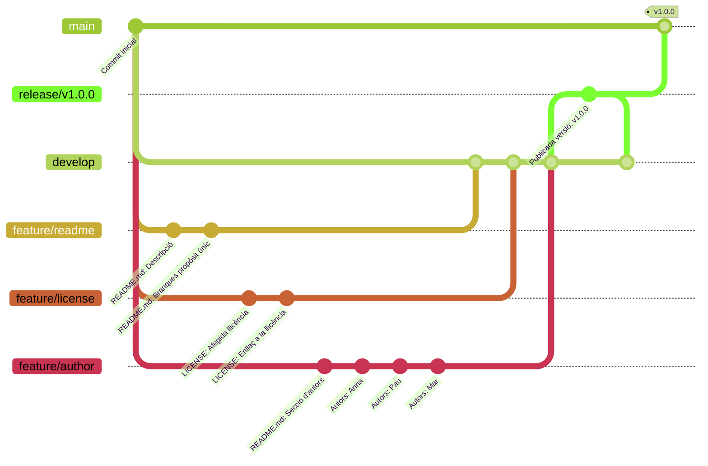

## Exemple: Estratègia de ramificació
En aquests apunts veurem com es pot utilitzar una estratègia de ramificació
en un projecte de desenvolupament de programari.

En aquest projecte utilitzarem la tècnica d'integració [[estrategies#merge-squash-ff-only]].

### Repositori remot
Anem a simular un projecte de desenvolupament de programari
on tres desenvolupadors treballen en diferents funcionalitats
de manera independent.

Per evitar haver de crear un repositori a [:material-github: GitHub](https://github.com)
crearem un repositori remot en la màquina local.

!!! warning
    Tracteu de seguir la mateixa estructura de directoris per seguir l'exemple
    correctament.

```shellconsole
--8<-- "docs/files/estrategies/stdout/remot.txt"
```

1. Aquesta comanda és necessària perquè el repositori siga configurat com a  __bare__ i puga ser utilitzat com a repositori remot.

### Branca de desenvolupament
El primer pas per establir un flux de treball
és crear la branca de desenvolupament `develop`.

```shellconsole
--8<-- "docs/files/estrategies/stdout/development.txt"
```

### Desenvolupament de funcionalitats
En aquest punt, podem començar a desenvolupar les diferents funcionalitats del projecte
en branques independents.

Crearem un repositori local per a cada desenvolupador,
simulant que cadascú treballa en el seu dispositiu.

```shellconsole
--8<-- "docs/files/estrategies/stdout/clone.txt"
```

Cada desenvolupador començarà a treballar en una nova funcionalitat.

- Anna treballarà en la funcionalitat `feature/readme`, que consistirà a afegir una descripció del projecte al README.
- Pau treballarà en la funcionalitat `feature/license`, que consistirà a afegir una llicència al projecte.
- Mar treballarà en la funcionalitat `feature/author`, que consistirà a afegir el nom dels autors del projecte al README.

A partir d'aquest moment, cada desenvolupador treballarà en el seu propi repositori,
en la seua pròpia branca de funcionalitat de manera independent i paral·lela.

!!! important
    És important que cada desenvolupador treballe en una única branca per funcionalitat, i que una mateixa branca no es compartisca entre desenvolupadors.

    Si existeix la necessitat de compartir una branca, segurament siga perquè la funcionalitat no està ben definida i podrà ser dividida en diverses funcionalitats més xicotetes.

#### Branca `feature/readme`
Anna començarà a treballar en la seua funcionalitat `feature/readme` en el seu repositori local.

!!! note
    Configurem l'usuari i el correu electrònic per a cada repositori local
    per simular que cada desenvolupador treballa en el seu propi dispositiu.

    També es mostra el nom en el prompt.

```shellconsole
--8<-- "docs/files/estrategies/stdout/feature_readme.txt"
```

Els passos seguits per Anna són:

- Crear la branca `feature/readme` a partir de `develop`.
- Realitzar els canvis pertinents.
- Publicar la branca `feature/readme` al repositori remot.

#### Branca `feature/license`
Pau començarà a treballar en la seua funcionalitat `feature/license` en el seu repositori local.

```shellconsole
--8<-- "docs/files/estrategies/stdout/feature_license.txt"
```

Els passos seguits per Pau són:

- Crear la branca `feature/license` a partir de `develop`.
- Realitzar els canvis pertinents.
- Publicar la branca `feature/license` al repositori remot.


#### Branca `feature/author`
Mar començarà a treballar en la seua funcionalitat `feature/author` en el seu repositori local.

```shellconsole
--8<-- "docs/files/estrategies/stdout/feature_author.txt"
```

Els passos seguits per Mar són:

- Crear la branca `feature/author` a partir de `develop`.
- Realitzar els canvis pertinents.
- Publicar la branca `feature/author` al repositori remot.


### Integració de les funcionalitats
En aquest punt, les tres funcionalitats han sigut desenvolupades de manera independent,
i encara no han segut integrades a la branca de desenvolupament `develop`.

```shellconsole
--8<-- "docs/files/estrategies/stdout/branques.txt"
```

!!! prep "Preparació del repositori"
    Pots crear un repositor amb l'estat anterior executant el següent script:
    /// collapse-code
    ```bash title="Bash script amb el desenvolupament de les funcionalitats"
    --8<-- "docs/files/estrategies/stdout/estrategies_development.sh"
    ```
    ///


Anem a veure com integrar les funcionalitats amb la tècnica __`merge --no-ff` + `merge --squash --ff-only`__
seguint el procés indicat a [[estrategies#integracio]].


#### Integració de `feature/readme`
Anna ja ha acabat la seua funcionalitat `feature/readme` i vol integrar-la a la branca `develop`.

Els passos que ha de seguir són:

1. Sincronitzar l'estat del repositori local amb el remot amb `git fetch`.

    ```shellconsole
    --8<-- "docs/files/estrategies/stdout/feature_readme_fetch.txt"
    ```

1. Actualitzar la branca `develop` amb els canvis del remot.

    En aquest cas, ja està actualitzada.

    ```shellconsole
    --8<-- "docs/files/estrategies/stdout/feature_readme_pull.txt"
    ```

1. Actualitzar la branca `feature/readme` amb els canvis `develop`.

    En aquest cas, ja està actualitzada.

    ```shellconsole
    --8<-- "docs/files/estrategies/stdout/feature_readme_merge.txt"
    ```

    1. L'opció `--no-edit` evita obrir l'editor de text i deixa el missatge de commit per defecte.

1. Fusionar la branca `feature/readme` amb `develop`.

    ```shellconsole
    --8<-- "docs/files/estrategies/stdout/feature_readme_merge_squash.txt"
    ```

1. Publicar els canvis de la branca `develop` al repositori remot.

    ```shellconsole
    --8<-- "docs/files/estrategies/stdout/feature_readme_push.txt"
    ```

1. Eliminar la branca `feature/readme` del repositori local i del remot.

    ```shellconsole
    --8<-- "docs/files/estrategies/stdout/feature_readme_delete.txt"
    ```


En aquest punt, la funcionalitat desenvolupada per Anna
ha sigut integrada a la branca de desenvolupament `develop`
i pot continuar treballant en altres funcionalitats.

#### Integració de `feature/license`
Pau ja ha acabat la seua funcionalitat `feature/license` i vol integrar-la a la branca `develop`.

Els passos que ha de seguir són:

1. Sincronitzar l'estat del repositori local amb el remot amb `git fetch`.

    ```shellconsole
    --8<-- "docs/files/estrategies/stdout/feature_license_fetch.txt"
    ```

1. Actualitzar la branca `develop` amb els canvis del remot.

    ```shellconsole
    --8<-- "docs/files/estrategies/stdout/feature_license_pull.txt"
    ```

1. Actualitzar la branca `feature/license` amb els canvis `develop`.

    ```shellconsole
    --8<-- "docs/files/estrategies/stdout/feature_license_merge.txt"
    ```

    1. L'opció `--no-edit` evita obrir l'editor de text i deixa el missatge de commit per defecte.

1. Fusionar la branca `feature/license` amb `develop`.

    ```shellconsole
    --8<-- "docs/files/estrategies/stdout/feature_license_merge_squash.txt"
    ```

1. Publicar els canvis de la branca `develop` al repositori remot.

    ```shellconsole
    --8<-- "docs/files/estrategies/stdout/feature_license_push.txt"
    ```

1. Eliminar la branca `feature/license` del repositori local i del remot.

    ```shellconsole
    --8<-- "docs/files/estrategies/stdout/feature_license_delete.txt"
    ```

#### Integració de `feature/author`
Mar ja ha acabat la seua funcionalitat `feature/author` i vol integrar-la a la branca `develop`.

Els passos que ha de seguir són:

1. Sincronitzar l'estat del repositori local amb el remot amb `git fetch`.

    ```shellconsole
    --8<-- "docs/files/estrategies/stdout/feature_author_fetch.txt"
    ```

1. Actualitzar la branca `develop` amb els canvis del remot.

    ```shellconsole
    --8<-- "docs/files/estrategies/stdout/feature_author_pull.txt"
    ```

1. Actualitzar la branca `feature/author` amb els canvis `develop`.

    !!! info "En aquest cas, han sorgit conflictes que hem hagut de solucionar manualment."

    ```shellconsole
    --8<-- "docs/files/estrategies/stdout/feature_author_merge.txt"
    ```

    1. L'opció `--no-edit` evita obrir l'editor de text i deixa el missatge de commit per defecte.
    2. S'han esborrat les marques de conflicte manualment.
    3. L'opció `--no-edit` evita obrir l'editor de text i deixa el missatge de commit per defecte.

1. Fusionar la branca `feature/author` amb `develop`.

    ```shellconsole
    --8<-- "docs/files/estrategies/stdout/feature_author_merge_squash.txt"
    ```

1. Publicar els canvis de la branca `develop` al repositori remot.

    ```shellconsole
    --8<-- "docs/files/estrategies/stdout/feature_author_push.txt"
    ```

1. Eliminar la branca `feature/author` del repositori local i del remot.

    ```shellconsole
    --8<-- "docs/files/estrategies/stdout/feature_author_delete.txt"
    ```

### Llançament de la versió 1.0.0
Anna és l'encarregada de preparar el llançament de la versió 1.0.0.

Els passos que ha de seguir són:

1. Actualitzar la branca `develop` amb els canvis del remot.

    ```shellconsole
    --8<-- "docs/files/estrategies/stdout/release_pull.txt"
    ```

1. Crear la branca de llançament `release/v1.0.0` a partir de la branca `develop`.
    
    ```shellconsole
    --8<-- "docs/files/estrategies/stdout/release_create.txt"
    ```

1. Realitzar les tasques necessàries per a preparar el llançament de la versió 1.0.0.

    ```shellconsole
    --8<-- "docs/files/estrategies/stdout/release.txt"
    ```

1. Integrar aquesta branca a la branca de desenvolupament `develop` i publicar-la.

    ```shellconsole
    --8<-- "docs/files/estrategies/stdout/release_merge_develop.txt"
    ```

1. Integrar aquesta branca a la branca principal `main` i publicar els canvis.

    ```shellconsole
    --8<-- "docs/files/estrategies/stdout/release_merge_main.txt"
    ```

1. Crear i publicar una etiqueta amb la versió 1.0.0.

    ```shellconsole
    --8<-- "docs/files/estrategies/stdout/release_tag.txt"
    ```

1. Eliminar la branca de llançament.

    ```shellconsole
    --8<-- "docs/files/estrategies/stdout/release_delete.txt"
    ```

### Estat final
L'estat final del repositori segons l'estratègia d'integració utilitzada
és el següent.

#### [`merge --no-ff` + `merge --squash --ff-only`][merge-squash]
```shellconsole
--8<-- "docs/files/estrategies/stdout/squash_final.txt"
```

#### [`merge --no-ff`][merge-no-ff] (_Gitflow_)
```shellconsole
--8<-- "docs/files/estrategies/stdout/merge_no_ff_final.txt"
```


#### [`rebase` + `merge --ff-only`][rebase-merge-ff-only]
```shellconsole
--8<-- "docs/files/estrategies/stdout/rebase_final.txt"
```

#### [`rebase` + `merge --no-ff`][rebase-merge-no-ff]
```shellconsole
--8<-- "docs/files/estrategies/stdout/rebase_merge_no_ff_final.txt"
```

[merge-squash]: estrategies.md#merge-squash-ff-only
[merge-no-ff]: estrategies.md#merge-no-ff
[rebase-merge-ff-only]: estrategies.md#rebase-merge-ff-only
[rebase-merge-no-ff]: estrategies.md#rebase-merge-no-ff
