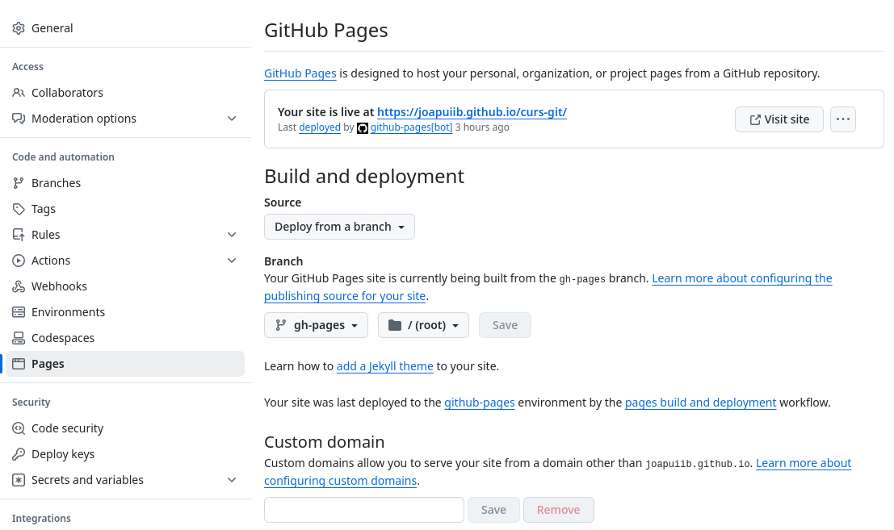

*[CI/CD]: Continuous Integration/Continuous Deployment
*[CI]: Continuous Integration
*[CD]: Continuous Deployment

## Automatització en CI/CD
El concepte d'__Integració Contínua__ (_Continuous Integration_ o CI) i
__Desplegament Continu__ (_Continuous Deployment_ o CD) és una pràctica
que permet als equips de desenvolupament integrar els canvis en el codi
de manera regular i distribuir-los de manera automàtica.

Les tasques més comunes que es poden automatitzar són:

- __Compilació i empaquetatge de l'aplicació__
- __Proves i validacions__
- __Anàlisi de la qualitat del codi__: _linters_, anàlisi estàtica, etc.
- __Desplegament de l'aplicació__ i gestió de llançaments
- __Generació i publicació de documentació__

## :octicons-play-24: GitHub Actions

[__:octicons-play-24: GitHub Actions__](https://github.com/features/actions)
és una funcionalitat de :simple-github: GitHub que permet automatitzar
aquestes tasques dins del flux de treball de desenvolupament de software.

Aquestes tasques poden ser automatitzades a l'apartat __:material-arrow-right-drop-circle-outline: Actions__
en un repositori de GitHub

!!! important
    Cada projecte té unes necessitats pròpies i, per tant,
    caldrà adaptar els processos de la naturalesa del projecte.


### Configuració d'una automatització

Les tasques d'automatització es defineixen en fitxers de configuració `YAML`,
que s'han de situar dins del directori `.github/workflows/`.

!!! docs
    [:octicons-link-external-16: Quickstart for GitHub Actions](https://docs.github.com/en/actions/writing-workflows/quickstart) – :simple-github: GitHub Docs
    { .spell-ignore }

La configuració bàsica d'una tasca d'automatització es fa amb els següents camps:

- `name`: Nom de la tasca
- `on`: [Esdeveniments][events]
    que faran que s'execute la tasca.
- `jobs`: Llista de tasques a executar.

Cada tasca té les següents seccions:

- `runs-on`: Tipus de màquina on s'executarà la tasca.
- `if`: [Condició][if] que ha de complir-se per a executar la tasca.
- `steps`: Llista de passos a executar.
    
    Cada pas ha de ser una comanda de shell (`run`) o una acció de GitHub predefinida (`uses`).

    - `name`: Nom del pas
    - `run`: Comanda de shell que s'executarà.
    - `uses`: [Acció de GitHub predefinida][uses] que s'executarà.

        Cada acció pot tenir els seus propis paràmetres de configuració.

[events]: https://docs.github.com/en/actions/writing-workflows/choosing-when-your-workflow-runs/using-conditions-to-control-job-execution
[if]: https://docs.github.com/en/actions/writing-workflows/choosing-when-your-workflow-runs/using-conditions-to-control-job-execution
[uses]: https://github.com/marketplace?type=actions

??? example "Exemples d'automatitzacions a aquest repositori"
    Aquest repositori està configurat amb [dues tasques d'automatització](https://github.com/joapuiib/curs-git/tree/main/.github/workflows).

    Podeu consultar les execucions d'aquestes tasques en l'apartat
    [__:material-arrow-right-drop-circle-outline: Actions__ del repositori](https://github.com/joapuiib/curs-git/actions).

    === "Publicació del lloc web"
        ```yaml title=".github/workflows/deploy.yml"
        --8<-- ".github/workflows/deploy.yml"
        ```

    === "Correcció ortogràfica"
        ```yaml title=".github/workflows/spellcheck.yml"
        --8<-- ".github/workflows/spellcheck.yml"
        ```

??? example "Altres exemples"
    - [:octicons-link-external-16: Execució de tests unitaris i integració en un projecte Java amb Maven](https://joapuiib.github.io/daw-ed/apunts/09_cicd/apunts/maven-proves/#automatitzacio-de-lexecucio-de-les-proves)
    - [:octicons-link-external-16: Publicació d'un paquet de Python a PyPI](https://github.com/joapuiib/mkdocs-data-plugin/blob/main/.github/workflows/publish-to-pypi.yml)

### Execució d'una automatització
Les tasques d'automatització s'executen automàticament
quan es compleixen les condicions definides en la secció `on`
de la configuració.

No obstant, podem configurar una tasca perquè es puga executar manualment.
Hem de definir un esdeveniment `workflow_dispatch` en la secció `on` de la configuració
que permet llançar la tasca des de l'apartat __:material-arrow-right-drop-circle-outline: Actions__
del repositori.

```yaml
on:
  workflow_dispatch:
```

A més, si necessitem provar una tasca d'automatització localment
sense haver de publicar canvis en el codi,
podem executar-la el nostre entorn de desenvolupament
amb l'eina [__`act`__](https://nektosact.com/).

```bash
act -W '.github/workflows/checks.yml'
```

Aquesta eina utilitza [__:simple-docker: Docker__](https://www.docker.com/)
per simular l'entorn d'execució semblant a l'entorn de GitHub Actions,
que permet provar les tasques sense haver de publicar els canvis al repositori remot.


## :octicons-browser-24: GitHub Pages
__[:octicons-browser-24: GitHub Pages][pages]__ és un servei de GitHub que permet publicar llocs web
estàtics[^1] directament des d'un repositori de GitHub.

[pages]: https://pages.github.com/

!!! note
    En comptes de :simple-github: GitHub gratuïts, es permet configurar
    GitHub Pages en repositoris públics. En canvi,
    en els repositoris privats, [es requereix d'un compte de pagament](https://docs.github.com/en/pages/getting-started-with-github-pages/about-github-pages)

    No obstant això, GitHub proporciona llicències gratuïtes per a estudiants i professors
    des de [:fontawesome-solid-graduation-cap: GitHub Education](https://education.github.com/).

Aquest servei és útil per a publicar:

- La documentació d'un projecte.
- Portafolis personals o de projectes.
- Llocs web estàtics generats per eines com [:simple-jekyll: Jekyll](https://jekyllrb.com/) o [MkDocs](https://www.mkdocs.org/).
    
!!! success "Exemple"
    Aquest lloc web està publicat amb __:octicons-browser-24: GitHub Pages__.
    


### Configuració de GitHub Pages
GitHub Pages pot ser habilitat i configurat en la secció __:octicons-gear-24: Settings__ del repositori,
dins de l'apartat __:octicons-browser-24: Pages__.


/// shadow-figure-caption
Configuració de GitHub Pages en aquest repositori
///

GitHub Pages pot ser configurat per publicar-se de dues maneres diferents:

- Mitjançant una __automatització__: Amb una procés que genera
    i publica el lloc web estàtic.

- A partir del contingut d'una branca i directori concrets del repositori.

    Es pot triar qualsevol branca, però sols els directoris `/` (arrel del repositori)
    o `/docs`.

[^1]: Un lloc web estàtic és un lloc web que no requereix d'un servidor web
    per generar les pàgines HTML, sinó que les pàgines ja estan generades
    i són servides directament.
