## Eines de gestió de projectes a GitHub
Els serveis d'allotjament de repositoris en línia,
com [:simple-github: GitHub][github] o [:simple-gitlab: GitLab][gitlab],
ofereixen una sèrie d'eines i funcionalitats que permeten
gestionar projectes de desenvolupament de programari col·laboratiu
de manera fàcil i eficaç.

[github]: https://github.com/
[gitlab]: https://about.gitlab.com/

En aquests apunts ens centrarem en la part de gestió de projectes,
com crear debats, comunicar incidències i organitzar tasques.

### :octicons-comment-discussion-16: Debats
Els [__debats o *Discussions*__](https://github.com/features/discussions)
és un espai de comunicació on els membres d'un projecte o els membres d'una comunitat
poden intercanviar idees, opinions, realitzar suggeriments o debatre sobre temes concrets.

Aquesta funcionalitat no està habilitada per defecte.
Per activar-la, cal anar al menú de configuració del repositori __:octicons-gear-16: Settings__
i habilitar-la.

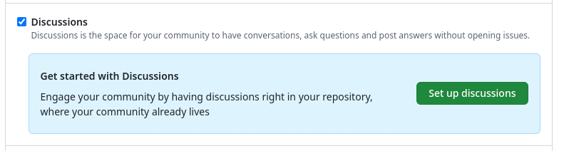
/// shadow-figure-caption
Configuració de les Discussions en un repositori de GitHub
///

??? example "Debats a aquest repositori"
    Aquest lloc web està allotjat a :simple-github: GitHub i s'ha
    habilitat la funcionalitat de debats.

    Podeu accedir mitjançant la secció __:octicons-comment-discussion-16: Discussions__ del menú superior
    o en [aquest enllaç](https://github.com/joapuiib/curs-git/discussions).

    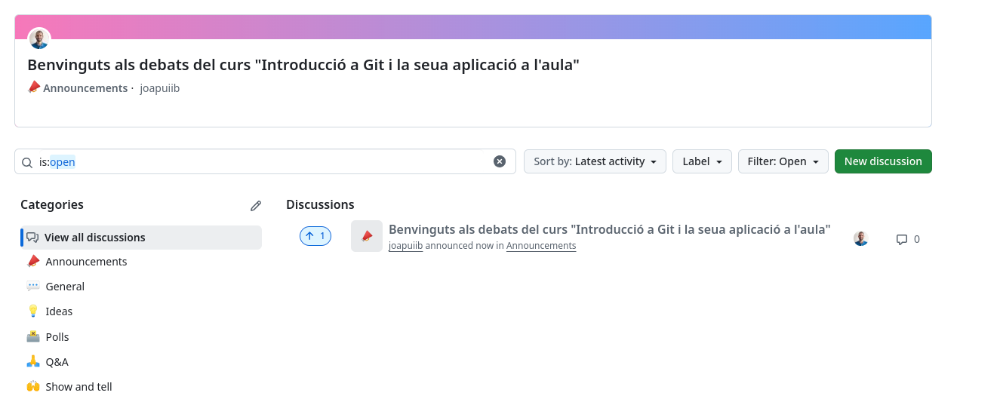
    /// shadow-figure-caption
    Debats en en [repositori d'aquest curs a :simple-github: GitHub](https://github.com/joapuiib/curs-git/discussions)
    ///

??? example "Debats a :simple-materialformkdocs: Material for MkDocs"
    [:simple-materialformkdocs: Material for MkDocs][mkdocs-material]
    és tema per al generador de llocs web estàtics [MkDocs][mkdocs]
    utilitzat per a generar aquest lloc web.

    El codi font d'aquest tema està allotjat en seu
    [repositori a :simple-github: GitHub][mkdocs-material]{
    on s'han habilitat els debats i la comunitat pot intercanviar idees, suggeriments
    o plantejar dubtes.

    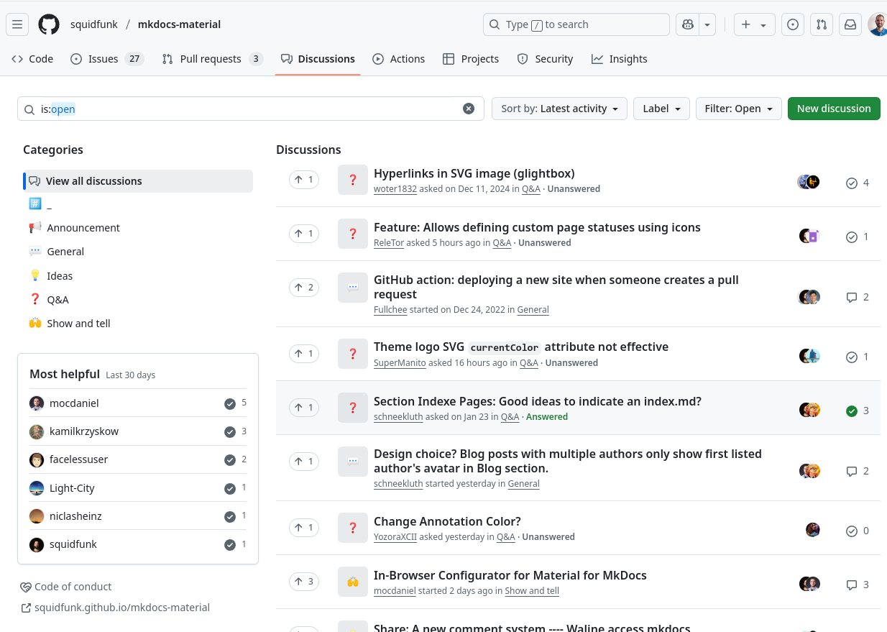
    /// shadow-figure-caption
    Debats en el [repositori `mkdocs-material` a :simple-github: GitHub][mkdocs-material-discussions]
    ///

[mkdocs]: https://www.mkdocs.org/
[mkdocs-material]: https://github.com/squidfunk/mkdocs-material
[mkdocs-material-discussions]: https://github.com/squidfunk/mkdocs-material/discussions

Els debats estan organitzats per categories, que permeten classificar-los
per temes i facilitar-ne la cerca. També es poden afegir noves categories
o eliminar les existents.

Les categories per defecte són les següents:

- __:mega: Announcements__: per a anuncis oficials.
    Sols els propietaris del repositori poden crear debats en aquesta categoria.
- __:speech_balloon: General__: per a debats generals.
- __:bulb: Ideas__: per a suggeriments i propostes.
- __:ballot_box: Polls__: per realitzar enquestes.
- __:pray_tone1: Qüestions (_Q&A_)__: per a preguntes i respostes.
- __:raised_hands_tone1: Show and Tell__: per a compartir projectes i treballs relacionats amb el repositori.

### :octicons-issue-opened-16: Incidències
Les [__Incidències o *Issues*__](https://guides.github.com/features/issues/)
són una eina de creació i seguiment d'incidències relacionades amb un projecte.

En aquest espai, també es permet la comunicació i la col·laboració
entre els membres del projecte per a aportar informació sobre la incidència,
debatre sobre la seua resolució.

??? example "Incidències a :simple-materialformkdocs: Material for MkDocs"
    [:simple-materialformkdocs: Material for MkDocs][mkdocs-material]
    també utilitza la funcionalitat d'incidències per informar sobre
    problemes, suggeriments o millores del tema.

    Podeu accedir a les incidències d'aquesta ferramenta
    mitjançant la secció [__:octicons-issue-opened-16: Issues__][mkdocs-material-issues] del menú superior.

    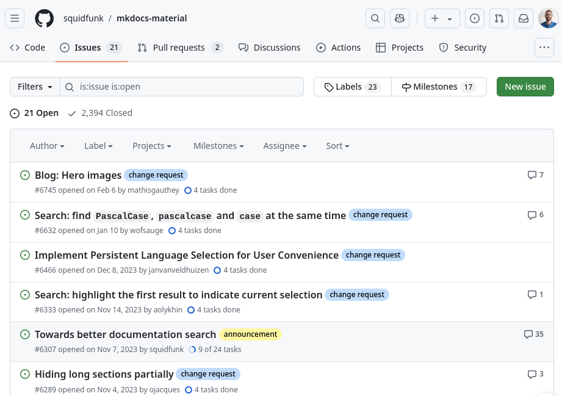
    /// shadow-figure-caption
    Llista d'incidències en el [repositori `mkdocs-material` a :simple-github: GitHub][mkdocs-material-issues]
    ///

[mkdocs-material-issues]: https://github.com/squidfunk/mkdocs-material/issues

Les incidències contenen la següent informació:

- __Títol__: descripció breu de la incidència.
- __Descripció__: Informació detallada de la incidència.

    En aquesta secció és important proporcionar tota la informació
    necessària per a entendre la incidència i poder resoldre-la.

    A més, els propietaris del repositori poden configurar [plantilles](https://docs.github.com/en/communities/using-templates-to-encourage-useful-issues-and-pull-requests/configuring-issue-templates-for-your-repository)
    per a la creació d'incidències, que faciliten la recopilació
    de la informació necessària.

- __:fontawesome-solid-circle-user: Assignació__: Permeten assignar a un o més membres del projecte a la incidència.
- __:octicons-tag-24: Etiquetes__: Permeten categoritzar les incidències per a facilitar-ne la gestió.
- __[:octicons-milestone-24: Fites](#fites)__: Permeten organitzar les incidències per complir un objectiu específic.
- __:octicons-link-external-16: Referències__: Permeten relacionar aquesta incidència amb altres incidències
    o consultar si aquesta ha segut referenciada per altres.
- __[:material-source-pull: Pull Requests][pr]__: si la incidència està relacionada amb una __sol·licitud de incorporació__.

[pr]: pull_requests.md

Les incidències es creen amb l'estat de __:octicons-issue-opened-16:{ .issue-open } Oberta__,
que pot ser canviat a __:octicons-issue-closed-16:{ .issue-closed } Tancada__ una vegada
ha sigut resolta.


??? example "Exemple d'incidència a :simple-materialformkdocs: Material for MkDocs"
    La següent imatge mostra una incidència en el repositori
    [:simple-materialformkdocs: Material for MkDocs][mkdocs-material],
    on s'informa d'un problema per deshabilitar la barra de cerca.

    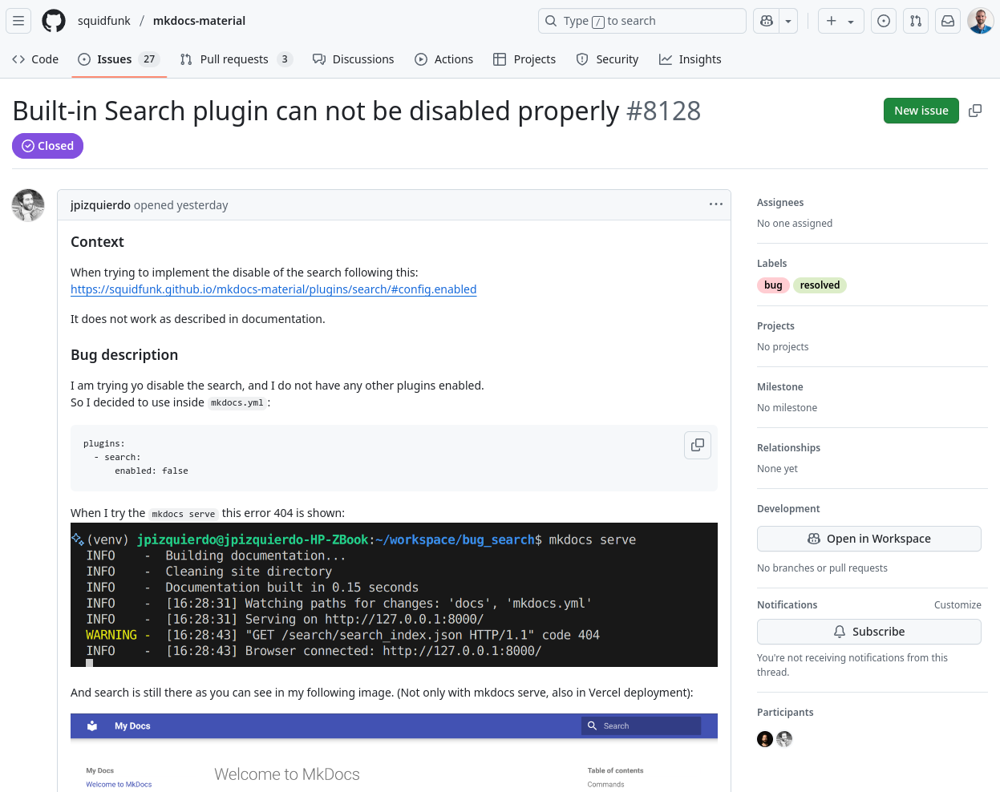
    /// shadow-figure-caption
    [Incidència][mkdocs-material-issue] en el repositori `mkdocs-material` a :simple-github: GitHub
    ///
    
[mkdocs-material-issue]: https://github.com/squidfunk/mkdocs-material/issues/8128

??? example "Exemple de plantilla per a incidències"
    En aquest repositori s'ha configurat una plantilla per informar
    d'una correcció en la documentació. Podeu veure el seu funcionament
    si trieu la plantilla __Correcció__ en la [creació d'una nova incidència][new-issue].

    Les plantilles es defineixen en fitxers :simple-markdown: Markdown,
    que s'han de guardar en la carpeta `.github/ISSUE_TEMPLATE`.

    ```markdown title=".github/ISSUE_TEMPLATE/correccio.md"
    --8<-- ".github/ISSUE_TEMPLATE/correccio.md"
    ```

[new-issue]: https://github.com/joapuiib/curs-git/issues

### :octicons-table-16: GitHub Projects
Els [__projectes de GitHub__](https://docs.github.com/es/issues/planning-and-tracking-with-projects/learning-about-projects/about-projects)
és una eina de gestió de tasques que permet organitzar, classificar i prioritzar
les tasques d'un projecte.

??? example "Projecte d'exemple"
    He creat un [__:octicons-table-16: Projecte d'exemple__][projecte-exemple] dins de l'organització del curs.
    Aquest projecte està buit, però és útil perquè pugueu entrar i veure les diferents vistes i opcions que ofereix.

    [projecte-exemple]: https://github.com/orgs/cursgit/projects/1

    [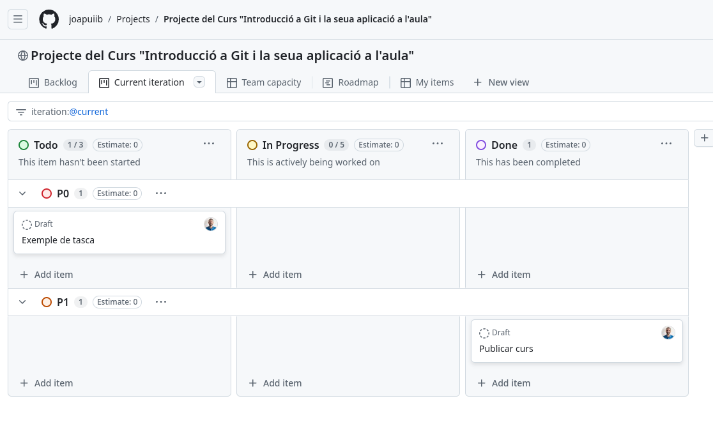](https://github.com/joapuiib/curs-git/projects)
    /// shadow-figure-caption
    Exemple de projecte en un repositori de GitHub
    ///

??? example "Exemple de projecte utilitzat a l'aula"
    La següent imatge mostra l'estat d'un projecte utilitzat a l'aula per a organitzar les tasques
    dels alumnes en un projecte de desenvolupament de programari col·laboratiu.

    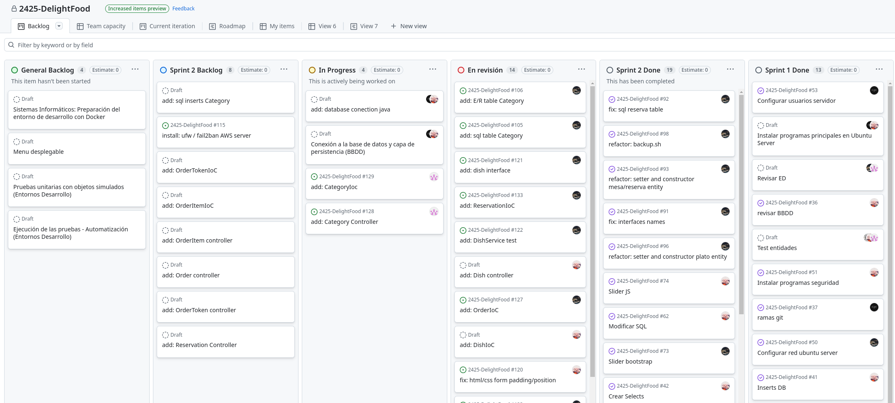
    /// shadow-figure-caption
    Exemple de projecte en un repositori de GitHub utilitzat a l'aula
    ///

Els projectes estan organitzats en diferents pestanyes,
que inclouen diferents vistes i organització de les tasques:

- __Backlog__: un tauler Kanban amb les tasques pendents organitzades per columnes.
- __Current iteration__: tasques que s'han planificat per a la iteració o _Sprint_ actual.
- __Roadmap__: un diagrama de Gantt amb les tasques planificades al llarg del temps.
- __Team planning__: Mostra una vista més detallada de cada tasca, organitzades per estat, prioritat i assignació.
- __My items__: Semblant a la vista de "Team planning", però mostra només les tasques assignades a l'usuari.

Cada tasca es crea com un __:material-dots-circle: Esborrany (_Draft_)__, que pot ser
convertida a una __[:octicons-issue-opened-16: Incidència](#incidencies)__ en el repositori.

Cada tasca conté la mateixa informació que una incidència, però a més, es pot
especificar:

- La __persona assignada__.
- La __prioritat__.
- La __mida__.
- L'__estimació de temps__.
- La __data d'inici__
- La __data de finalització__.
- La __iteració__ a la que pertany.

??? example "Exemple de tasca"
    La següent imatge mostra un exemple d'una tasca
    creada com a __:material-dots-circle: Esborrany (_Draft_)__ en un projecte de GitHub.

    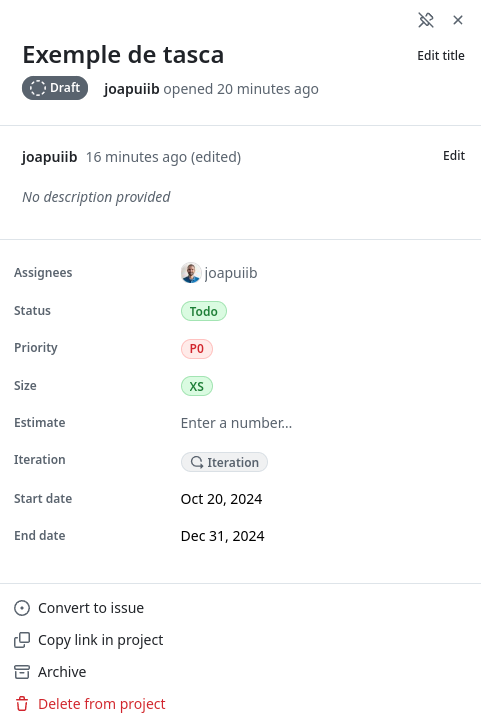
    /// shadow-figure-caption
    Exemple de tasca en un projecte de GitHub
    ///


### :octicons-milestone-24: Fites
Les [__fites o *Milestones*__][milestones] són un mecanisme per organitzar
[:octicons-issue-opened-16: Incidències](#incidencies)
i [:material-source-pull: _Pull Requests_][pr]
dins d'un repositori. S'utilitzen per __definir objectius específics__
en el desenvolupament del projecte.

[milestones]: https://docs.github.com/es/issues/using-labels-and-milestones-to-track-work/about-milestones

Cada __fita__ conté la següent informació:

- __Títol__
- __Descripció__
- __Data de venciment__ (Opcional)
- __Percentatge de progrés__, calculat respecte de les incidències obertes i tancades.


Podeu accedir a les fites amb el botó __:octicons-milestone-24: Milestones__,
des de la vista de __:octicons-issue-opened-16: Issues__ o 
__:material-source-pull: Pull Requests__ del repositori.

??? example "Fites a aquest repositori"
    En [aquest repositori][curs-git] s'ha creat [una fita][curs-git-milestone]
    per a organitzar les incidències relacionades amb la preparació de la documentació
    per a portar a terme el curs.

    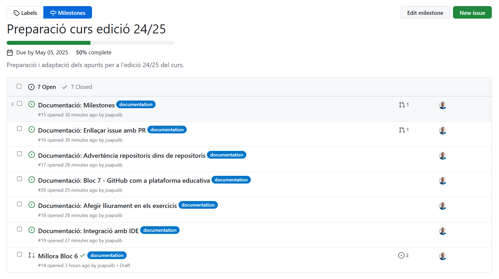
    /// shadow-figure-caption
    [Fita en aquest repositori][curs-git-milestone]
    ///

[curs-git]: https://github.com/joapuiib/curs-git/
[curs-git-milestone]: https://github.com/joapuiib/curs-git/milestone/1

### :material-tray-arrow-up: Llançaments
Els [__llançaments o *Releases*__](https://docs.github.com/es/github/administering-a-repository/releasing-projects-on-github/about-releases)
és una funcionalitat de GitHub que permet indicar quan una versió del projecte ha segut llançada, incloent informació rellevant sobre els canvis realitzats i les persones
que han contribuït.

Els llançaments __sempre estan associats__ a una __[[etiquetes|:octicons-tag-16: etiqueta]]__,
que pot existir prèviament o es pot crear al moment. Encara que són similars, no hem de confondre un llançament amb una etiqueta.
Els llançaments són elements de GitHub i, en canvi, les etiquetes són objectes de Git.

??? example "Llançaments a :simple-materialformkdocs: Material for MkDocs"
    [:simple-materialformkdocs: Material for MkDocs][mkdocs-material]
    també utilitza la funcionalitat de llançaments per a indicar que s'ha
    publicat una nova versió del tema.

    Podeu accedir als llançaments d'aquest repositori mitjançant la secció [__Releases__][mkdocs-material-releases]
    de la secció lateral de la pàgina principal del repositori.

    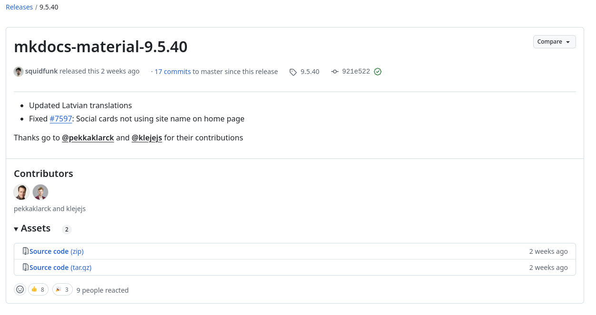
    /// shadow-figure-caption
    Exemple de llançament en el [repositori `mkdocs-material` a :simple-github: GitHub][mkdocs-material-releases]
    ///

[mkdocs-material-releases]: https://github.com/squidfunk/mkdocs-material/releases

Des de la secció de llançaments es pot crear un nou llançament,
on cal incloure la següent informació:

- __Títol__: descripció breu del llançament o número de versió.
- __Descripció__: informació detallada dels canvis realitzats.
- __Etiqueta__: etiqueta associada al llançament.
- __Arxius binaris__: arxius binaris associats al llançament.

!!! info
    A més, existeix l'opció de [__generar les notes de llançament__](https://docs.github.com/en/repositories/releasing-projects-on-github/automatically-generated-release-notes),
    que inclouran informació sobre les __[:material-source-pull: Pull requests][pr]__ i les persones que han contribuït
    de manera automàtica.

??? example "Creació d'un llançament"
    La següent imatge mostra la creació d'un nou llançament en un repositori de GitHub.

    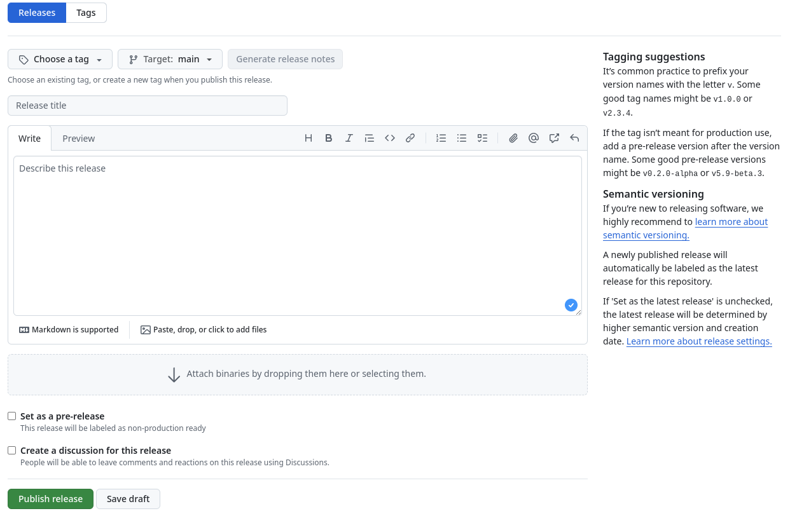
    /// shadow-figure-caption
    Creació d'un llançament en un repositori de GitHub
    ///
