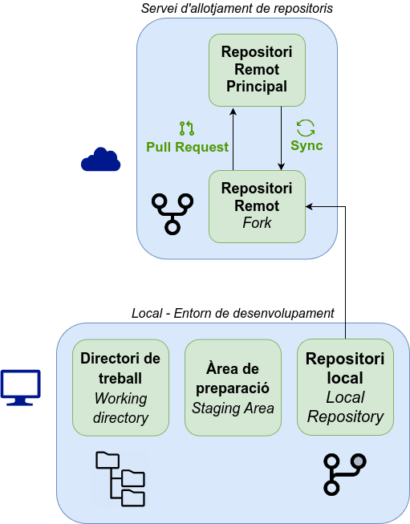
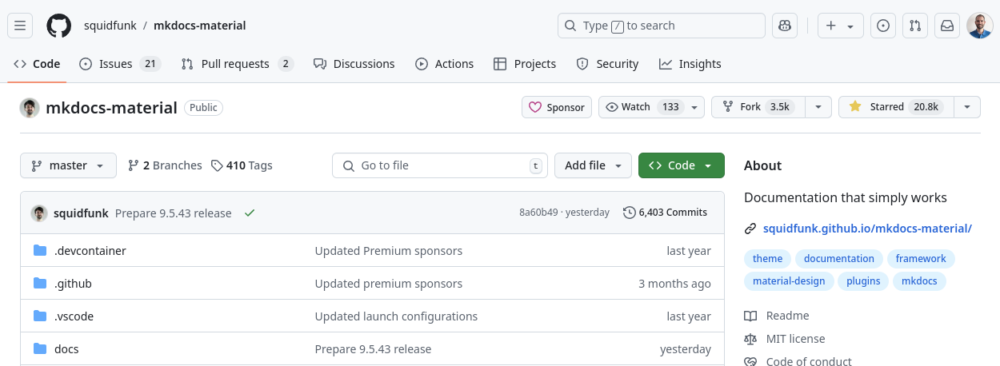
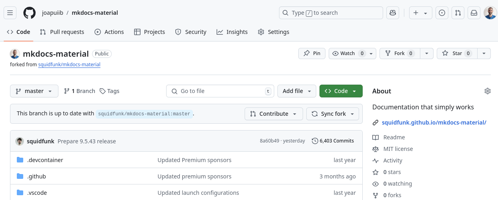
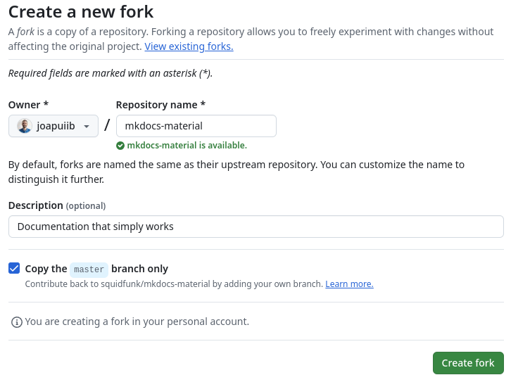
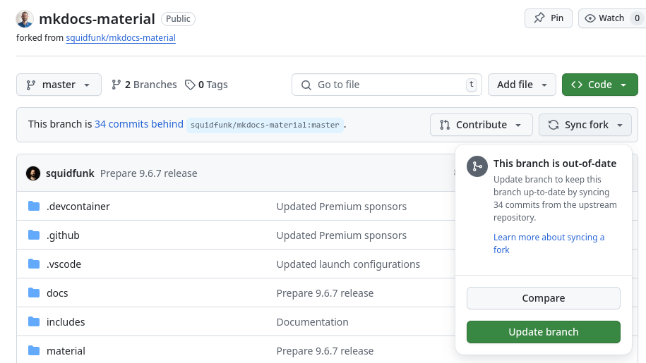

*[PR]: Pull Request

## Forks i Pull Requests
Dins de les eines de col·laboració que ofereixen els serveis d'allotjament de repositoris en línia
com :simple-github: GitHub o :simple-gitlab: GitLab, hi ha dues funcionalitats clau:

- __:material-source-fork: Forks__: permeten copiar un repositori d'un altre usuari o organització com a propi.

    En aquesta còpia, l'usuari pot realitzar canvis, afegir funcionalitats o corregir errors
    sense afectar el repositori original.

    El _fork_ queda enllaçat amb el repositori original, de manera que es pot mantindre sincronitzat
    si el repositori original es modifica.

- __:material-source-pull: Pull Requests__: permeten sol·licitar la incorporació de canvis d'un repositori a un altre.

    Si un usuari ha realitzat canvis en un _fork_ i vol que aquests canvis es incorporen
    al repositori original, pot enviar una sol·licitud de __pull request__. Aquesta sol·licitud
    serà revisada pels propietaris del repositori original, que podran acceptar-la o rebutjar-la.

Aquestes dues funcionalitats són essencials per a la col·laboració en projectes
de desenvolupament de programari de manera distribuïda i col·laborativa, sobretot
en projectes de __:material-open-source-initiative: codi obert__.

## :material-source-fork: Forks
Una [__bifurcació o *fork*__](https://docs.github.com/es/pull-requests/collaborating-with-pull-requests/working-with-forks/fork-a-repo)
és una còpia d'un repositori que pertany a un usuari o organització
com a propi.

En el teu _fork_ pots realitzar qualsevol canvi, com per exemple:

- Corregir errors.
- Afegir funcionalitats.
- Millorar la documentació.
- Adaptar el codi a les teues necessitats.

Un _fork_ sempre està enllaçat amb el repositori original,
de manera que es si es realitzen canvis en el repositori original,
pots decidir incorporar-los al teu _fork_.

/// shadow-figure-caption
    attrs: { class: "no-shadow" }
Estructura de treball amb Forks i Pull Requests
///

??? example "Exemple de bifurcació de :simple-materialformkdocs: Material for MkDocs"
    La següent imatge mostra el repositori de [:simple-materialformkdocs: Material for MkDocs][mkdocs-material]

    
    /// shadow-figure-caption
    [Repositori :simple-materialformkdocs: Material for MkDocs][mkdocs-material]
    ///

    Per a poder realitzar contribucions, s'ha creat un [:material-source-fork: __*fork*__][mkdocs-material-fork] del repositori original.

    
    /// shadow-figure-caption
    [Repositori :simple-materialformkdocs: Material for MkDocs bifurcat][mkdocs-material-fork]
    ///

[mkdocs-material]: https://github.com/squidfunk/mkdocs-material
[mkdocs-material-fork]: https://github.com/joapuiib/mkdocs-material

### Creació d'un Fork
Per crear un _fork_ d'un repositori, cal accedir a la pàgina del repositori
i fer clic al botó __:material-source-fork: Fork__ que apareix a la part superior dreta.

??? example "Creació d'un fork de :simple-materialformkdocs: Material for MkDocs"
    Vegem el menú de creació d'un _fork_ en el repositori :simple-materialformkdocs: Material for MkDocs.

    
    /// shadow-figure-caption
    Creació d'un fork en el repositori :simple-materialformkdocs: Material for MkDocs
    ///

### :octicons-sync-24: Sincronització amb el repositori original
Si el repositori original ha realitzat nous canvis des de la creació del _fork_,
pots incorporar-los al teu _fork_ per mantindre'l actualitzat amb el botó __:octicons-sync-24: Sync fork__.

??? example "Sincronització amb el repositori original"
    Com que el repositori original :simple-materialformkdocs: Material for MkDocs té nous canvis
    (concretament 34 nous _commits), podem sincronitzar el nostre _fork_.

    
    /// shadow-figure-caption
    Sincronització amb el repositori original en el repositori :simple-materialformkdocs: Material for MkDocs
    ///

### :octicons-git-pull-request-24: Pull Request
En cas que volguérem contribuir al repositori original,
podem crear una [__sol·licitud d'incorporació de canvis__ o __:octicons-git-pull-request-24: Pull Request__][pr],
que veurem en els següents apunts.

[pr]: pull_requests.md
