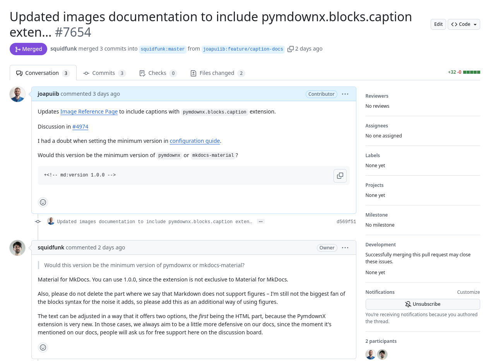
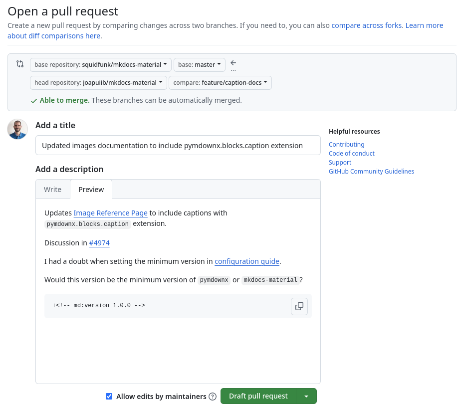
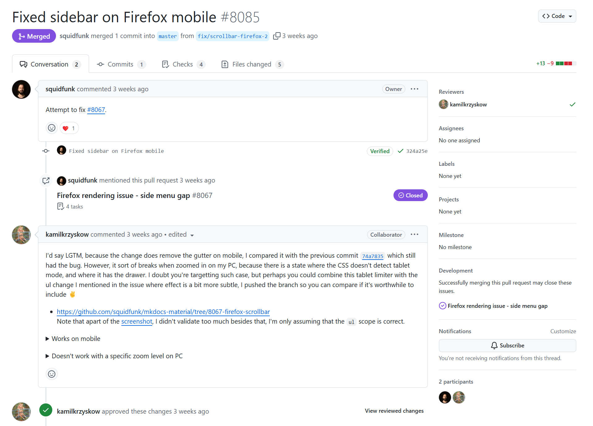
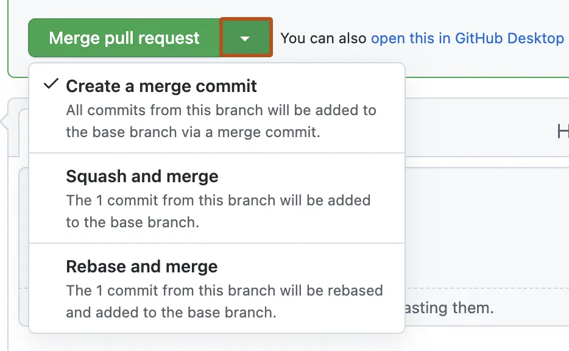
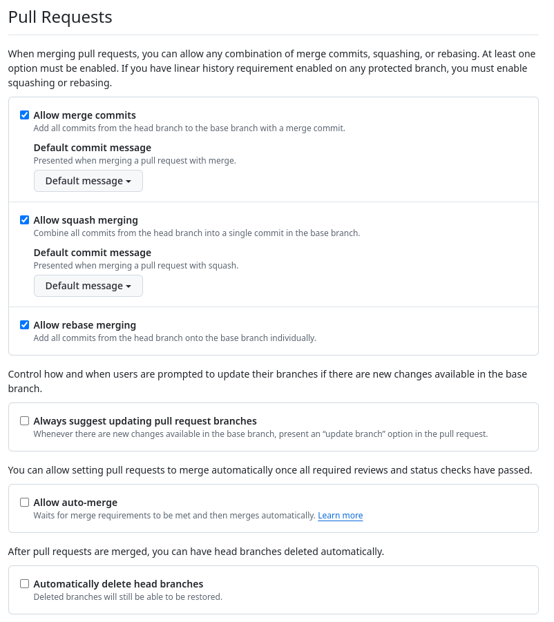
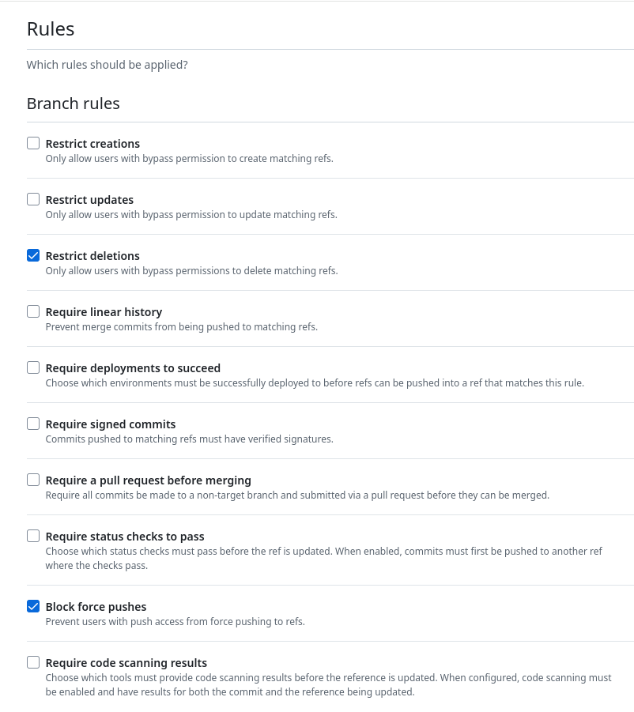

*[PR]: Pull Request

## :material-source-pull: Pull Requests
Una [__Sol·licitud de Incorporació o *Pull Request (PR)*__](https://docs.github.com/es/pull-requests/collaborating-with-pull-requests)
és una sol·licitud per a incorporar canvis a una branca d'un repositori.

Les PR poden ser utilitzats per a:

- Incorporar canvis d'una branca a una altra branca dins del mateix repositori.
- Incorporar canvis d'una [:material-source-fork: __bifurcació o *fork*__][fork] al repositori principal.

[fork]: forks.md

La utilització de les PR aporta molts avantatges, com ara:

- __Revisió de canvis__: Permet revisar els canvis realitzats abans de la seua integració al projecte.
- __Debat de canvis__: Facilita el debat i la revisió conjunta dels canvis amb altres desenvolupadors o col·laboradors.
- __[Automatització de tasques][automatitzacio]__: Ofereix la possibilitat d'executar tasques automàtiques abans de la incorporació dels canvis,
    com ara la realització de proves o la comprovació de la qualitat del codi.
- __[Estratègia de ramificació][estrategies]__: Permet incorporar els canvis de manera ordenada i controlada.

[automatitzacio]: automatitzacio.md
[estrategies]: ../05_estrategies/estrategies.md

Aquesta funcionalitat és essencial per a la col·laboració en projectes,
especialment els de __:material-open-source-initiative: codi obert__,
on els mantenidors poden revisar els canvis proposats per la comunitat.

??? example "Exemple de Pull Request a :simple-materialformkdocs: Material for MkDocs"
    En el repositori :simple-materialformkdocs: Material for MkDocs
    existeixen múltiples PR on s'han realitzat canvis per a millorar el tema
    o actualitzar la documentació.

    
    /// shadow-figure-caption
    Exemple de [Pull Request en el repositori :simple-materialformkdocs: Material for MkDocs](https://github.com/squidfunk/mkdocs-material/pulls)
    ///

### Creació d'una Pull Request
Per crear una PR, cal accedir al teu _fork_ o branca i fer clic al botó __:material-source-pull: Pull Request__.

En el procés de creació d'una PR s'han de seleccionar els repositori i les branques
associades a la PR:

- __Base repository__: Repositori on s'incorporaran els canvis.
- __Base__: Branca de destí on s'incorporaran els canvis.
- __Head repository__: Repositori on es troba la branca amb els canvis.
- __Compare__: Branca amb els canvis que es volen incorporar.

A més, es pot afegir informació addicional com:

- __Títol__: Breu descripció dels canvis realitzats.
- __Descripció__: Informació addicional sobre els canvis realitzats.


??? example "Creació d'una Pull Request"
    En aquest exemple s'ha creat una PR per incorporar nous canvis a la documentació
    de [:simple-materialformkdocs: Material for MkDocs][mkdocs-material].

    - __Base repository__: [`squidfunk/mkdocs-material`][mkdocs-material]
    - __Base__: Branca `master`
    - __Head repository__: El fork [`joapuiib/mkdocs-material`][mkdocs-material-fork]
    - __Compare__: Branca `feature/caption-docs`


    
    /// shadow-figure-caption
    Comparació de canvis en una Pull Request
    ///

[mkdocs-material]: https://github.com/squidfunk/mkdocs-material
[mkdocs-material-fork]: https://github.com/joapuiib/mkdocs-material

Una vegada creat la PR, es pot sol·licitar la revisió dels canvis a altres usuaris
i realitzar els canvis necessaris fins a la seua acceptació.

Les PR poden estar en quatre estats diferents:

- __:octicons-git-pull-request-draft-24:{ .pr-draft } Esborrany (*Draft*)__: Creada, però no s'ha finalitzada.
- __:octicons-git-pull-request-24:{ .pr-open } Oberta (*Open*)__: En procés de revisió i a punt per a ser fusionat.
- __:material-source-merge:{ .pr-merged } Fusionada (*Merged*)__: Acceptada i incorporada al repositori.
- __:octicons-git-pull-request-closed-24:{ .pr-closed } Tancada (*Closed*)__: Rebutjada o tancada sense incorporar.


### Enllaçar incidències a una Pull Request
Quan es treballa en un projecte, sovint les Pull Request estan relacionades amb
[:octicons-issue-opened-16: incidències][issues] específiques.
GitHub permet enllaçar-les de tal manera que,
quan la PR és acceptada, les incidències es tancaran automàticament.

[issues]: eines_gestio.md#incidencies

A més, __millora la traçabilitat__ del desenvolupament i __facilita el seguiment dels canvis__
realitzats per a la resolució de les incidències.

!!! docs
    - [:octicons-link-external-16: Linking a pull request to an issue](https://docs.github.com/en/issues/tracking-your-work-with-issues/using-issues/linking-a-pull-request-to-an-issue) – :simple-github: GitHub Docs

Les incidències poden ser enllaçades a una PR de dues maneres:

- Mitjançant l'apartat __Development__ en la barra lateral en la pàgina.
- Utilitzant __paraules clau__ amb el número incidència en la descripció.
    - `close`
    - `closes`
    - `closed`
    - `fix`
    - `fixes`
    - `fixed`
    - `resolve`
    - `resolves`
    - `resolved`

    Un exemple de sintaxi és:

    ```text
    Closes #10
    ```
    > On `#10` és el número d'incidència que es desitja enllaçar.


??? example "Exemple d'incidències enllaçades a una PR"
    La següent imatge mostra una [PR sobre el repositori :simple-materialformkdocs: Material for MkDocs][mkdocs-material-pr-issue]
    s'ha referenciat una incidència per resoldre la barra lateral en el navegador :simple-firefox: Firefox.

    
    /// shadow-figure-caption
    Incidència enllaçada a una Pull Request
    ///

[mkdocs-material-pr-issue]: https://github.com/squidfunk/mkdocs-material/pull/8085


### Incorporació d'una Pull Request
Quan una PR és acceptada, els canvis s'incorporen a la branca de destí i la PR és marcada com a fusionada.

La incorporació del PR es pot realitzar de tres maneres diferents:

- __Crear un _commit_ de fusió__: es crea un nou _commit_ que incorpora els canvis de la PR, com en una [[branques#fusio-de-branques-divergents]].
- __Fusió en un sol _commit_ (`squash`)__: es fusionen tots els canvis de la PR en un sol _commit_ mitjançant [[squash]].
- __Canvi de base (`rebase`)__: es realitza un [[branques#canvi-de-base-rebase]] de la branca de la PR respecte a la branca de destí
    i es fusiona mitjançant una [[branques#fusio-directa]].

!!! recommend
    La fusió en un sol _commit_ (`squash`) és útil per a mantindre una història de _commits_
    més clara, ordenada i concisa.

    Si es desitja consultar el procés de revisió de la branca, sempre es pot accedir a la PR
    on es troben tots els canvis realitzats.

{: style="max-height: 300px;"}
/// shadow-figure-caption
Tipus de fusió d'una Pull Request
///


### Configuració de les Pull Requests
El repositori pot ser configurat per habilitar les diferents tècniques de incorporació,
entre altres configuracions a l'__apartat Pull Requests__ de la configuració
del repositori (__:octicons-gear-16: Settings__).


/// shadow-figure-caption
Configuració de les opcions de les Pull Requests
///

## Flux de treball
El flux de treball amb les PR no és diferent a les a [[estrategies]],
sinó que ens proporciona un mecanisme addicional per a la revisió i incorporació de canvis.

Aquest flux de treball pot ser el següent:

=== "En el mateix repositori"

    1. Crear una nova branca per a realitzar els canvis.
    1. Realitzar els canvis en la branca.
    1. Crear una PR per a incorporar els canvis a la branca principal o de desenvolupament.
    1. Revisar i debatre els canvis amb els revisors.
    1. Actualitzar la PR amb els canvis necessaris o amb l'estat més recent
        de la branca de destí.
    1. Incorporar els canvis al repositori original.

=== "En un _fork_ (:material-open-source-initiative: Codi obert)"

    1. Crear un _fork_ del repositori principal.
    1. Clonar el _fork_ en el teu entorn de desenvolupament.
    1. Crear una branca per a realitzar els canvis.
    1. Realitzar els canvis en la branca.
    1. Publicar la branca en el _fork_.
    1. Crear una PR per a incorporar els canvis del _fork_ al repositori principal.
    1. Revisar i debatre els canvis amb els revisors.
    1. Actualitzar la PR amb els canvis necessaris o amb l'estat més recent
        de la branca de destí.
    1. Incorporar els canvis al repositori original.
    1. Sincronitzar (:octicons-sync-24: _Sync_) el _fork_ amb els nous canvis
        del repositori original.

## Protecció de branques
Per a evitar canvis no desitjats en les branques principals
i evitar problemes deguts a una mala aplicació de les [[estrategies]],
les branques importants (com `main` o `develop`) poden ser protegides
mitjançant [__conjunts de regles (_Rulesets_)__](https://docs.github.com/es/github/administering-a-repository/defining-the-mergeability-of-pull-requests).

Per configurar les regles de protecció de branques, cal accedir a la configuració del repositori __:octicons-gear-16: Settings__
i buscar l'apartat __:material-book-arrow-up-outline: Rules__.

Aquestes regles permeten definir les condicions per modificar la branca especificada,
com ara:

- Protegir-les contra creació, modificació o eliminació.
- Requerir mantindre una història lineal.
- No permetre publicacions forçades (`push --force`).
- Requerir que les [[actions|comprovacions automàtiques]] s'hagen completat satisfactòriament.
- Requerir que la fusió es realitze mitjançant una PR.
    
    En aquest cas, es poden configurar altres opcions com:

    - Requerir que la branca estiga actualitzada amb la branca de destí.
    - Requerir revisió d'un nombre mínim de revisors.
    - Requerir una resolució dels conflictes abans de la fusió.


/// shadow-figure-caption
Protecció de branques
///

