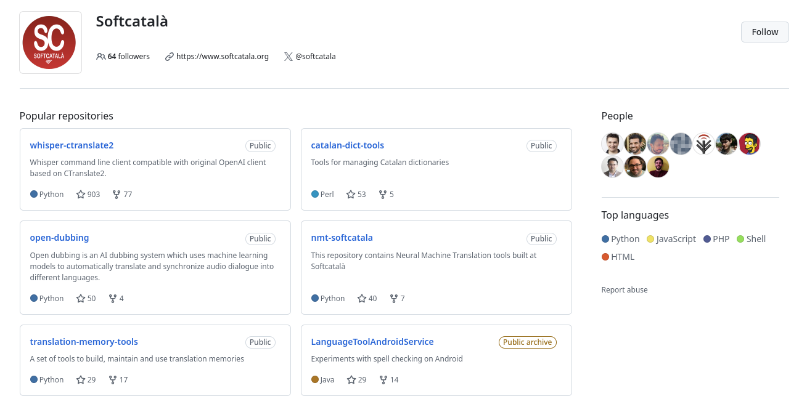
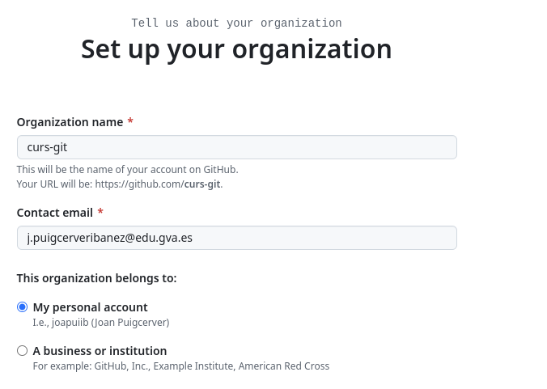
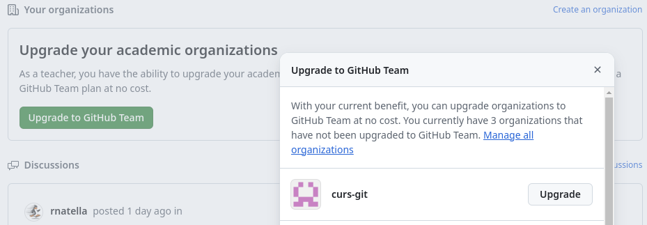
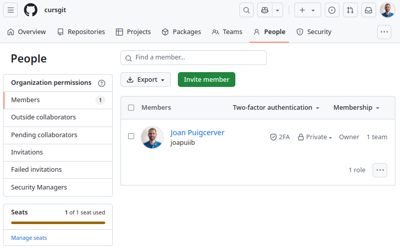
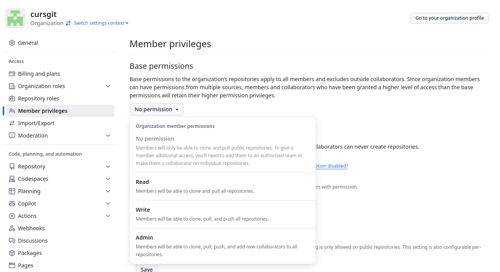
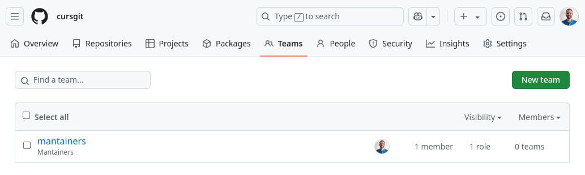
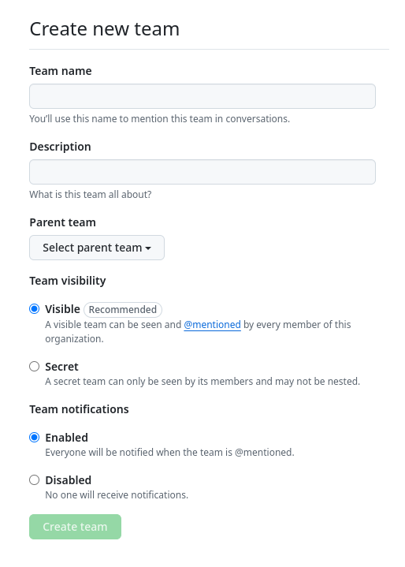
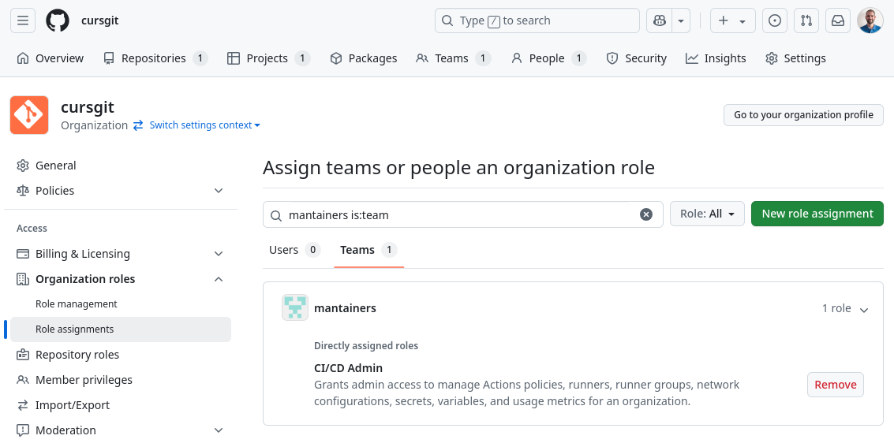

## GitHub com a plataforma educativa

:simple-github: GitHub és una plataforma que permet als estudiants i als docents allotjar el projectes de desenvolupament,
compartir-los i treballar de manera col·laborativa. A més, GitHub ofereix eines per a la gestió de projectes que poden
ser adaptades per a l'ús en l'entorn educatiu.

GitHub es pot convertir en una plataforma educativa molt potent, per les següents raons:

- **Control de versions**: Treballar amb un sistema de control de versions és essencial per a qualsevol projecte de
    desenvolupament, especialment en l'àmbit professional. Treballar d'aquesta manera des del primer moment permetrà
    als estudiants adquirir una habilitat i uns hàbits que els seran molt útils en el futur.
- **Allotjament centralitzat**: GitHub permet allotjar tots els projectes en un únic lloc, el que facilita la
    gestió i la revisió dels projectes per part dels docents.
- **Retroacció individualitzada**: Gràcies al control de versions, els docents poden revisar els canvis que han fet
    cadascun dels estudiants i oferir una retroacció individualitzada.
- **Treball col·laboratiu**: GitHub facilita la col·laboració entre els estudiants, ja que permet treballar en
    branques independents i fusionar els canvis de manera senzilla.
- **Gestió de projectes**: GitHub ofereix eines que faciliten la gestió de projectes, que poden ser
    adaptades per a l'entorn educatiu mitjançant l'ús de metodologies actives.

## :octicons-organization-16: Organitzacions
Les [__organitzacions__](https://docs.github.com/en/organizations/collaborating-with-groups-in-organizations/about-organizations)
són comptes compartits que permeten agrupar diversos repositoris i col·laboradors, gestionant els permisos d'accés
d'una manera més centralitzada.

Normalment, representen a alguna institució, empresa o projecte de codi obert.

??? picture "Organització Softcatalà"
    
    /// shadow-figure-caption
    Organització [:simple-softcatala: Softcatalà a GitHub](https://github.com/Softcatala).
    ///

### Crear una organització
Pots crear una nova organització a l'apartat [__:octicons-organization-16: Organitzacions__](https://github.com/settings/organizations)
del teu compte de GitHub.

Quan crees una organització, et demanarà quin pla vols utilitzar.

!!! important
    En l'àmbit educatiu, podem utilitzar el pla gratuït i després sol·licitar la millora a GitHub Team a través de
    [GitHub Global Campus](https://education.github.com/globalcampus/teacher).

Després, es demanarà especificar la següent informació:

- Nom per a la organització, que ha de ser únic a GitHub.
- Correu electrònic de contacte.
- A qui pertany la organització (personal, empresa o institució).

??? picture "Formulari per a crear una organització"
    
    /// shadow-figure-caption
    Formulari per a crear una organització.
    ///

### Millorar una organització a GitHub Team
Pot sol·licitar la millora d'una organització a GitHub Team a través de
[GitHub Global Campus](https://education.github.com/globalcampus/teacher).

??? picture "Millorar una organització a GitHub Team"
    
    /// shadow-figure-caption
    Millorar una organització a GitHub Team.
    ///

### Convidar membres a una organització
Per a convidar membres a una organització, cal anar a l'apartat __:material-account: People__
de la organització i afegir els membres manualment amb el botó __Invite member__.

??? picture "Convidar membres a una organització"
    
    /// shadow-figure-caption
    Convidar membres a una organització.
    ///

### Configuració de l'organització
A l'apartat __:octicons-gear-16: Settings__ de l'organització,
es poden configurar tots els paràmetres de l'organització.

Una de les opcions més importants és la configuració
dels permisos dels membres de l'organització a l'apartat __:material-account-multiple: Member privileges__.

!!! recommend
    En aquest apartat, es recomana configurar els permisos per defecte (_Base permissions_)
    com a _No permission_.

    D'aquesta manera, els estudiants no podran veure els repositoris privats
    d'altres companys de classe.

??? picture "Configuració dels permisos de l'organització"
    
    /// shadow-figure-caption
    Configuració dels permisos de l'organització.
    ///

## :octicons-people-16: Equips
Els [__equips__][equips] és una funcionalitat de les organitzacions que permet agrupar
membres per centralitzar la gestió dels permisos d'accés als repositoris.

També permet crear canals de comunicació entre els membres d'un equip
o mencionar a un equip sencer en un comentari.

[equips]: https://docs.github.com/es/organizations/organizing-members-into-teams/about-teams

??? picture "Equip d'una organització"
    
    /// shadow-figure-caption
    Equip [`@mantainers`][mantainers] de l'organització [`cursgit`][cursgit].
    ///

[cursgit]: https://github.com/cursgit
[mantainers]: https://github.com/orgs/cursgit/teams/mantainers

### Crear un equip
Per a crear un nou equip, cal anar a l'apartat __:octicons-people-16: Teams__ de l'organització
i fer clic al botó __New team__.

Es poden definir els següents paràmetres:

- __Nom__ de l'equip.
- __Descripció__ de l'equip.
- __Equip superior__: Definir un equip superior per a crear una jerarquia d'equips.
- __Visibilitat__: Visible o privat.
- __Notificacions__: Permet habilitar o deshabilitar les notificacions per a l'equip.

??? picture "Formulari per a crear un nou equip"
    
    /// shadow-figure-caption
    Formulari per a crear un nou equip.
    ///

### Permisos d'un equip
A l'apartat __:octicons-organization-16: Organization roles__ de la __:octicons-gear-16: Configuració__
de l'organització es poden definir els permisos dels seus membres i equips.

??? picture "Permisos d'un equip"
    
    /// shadow-figure-caption
    Permisos d'un equip.
    ///
