## Proposta d'ús de les organitzacions en l'àmbit educatiu
En aquest apartat es proposa una metodologia de treball per tal d'aprofitar les eines
de :simple-github: GitHub i facilitar la gestió del treball de l'alumnat
i la revisió dels projectes per part del professorat.

Aquesta metodologia es basa en la __creació d'una [:octicons-organization-16: organització][organitzacio]__,
on s'allotjaran els repositoris dels estudiants de manera centralitzada
i on el docent tindrà accés a tots els projectes.

[organitzacio]: organitzacions.md

Els __estudiants treballaran en els seus propis :octicons-repo-locked-16: repositoris privats__
i el __docent pot crear :octicons-repo-16: repositoris públics__ amb solucions o exemples.

D'aquesta manera:

- El professorat tindrà accés a tots els repositoris dels estudiants.
- L'alumnat tindrà accés a tots els repositoris públics creats pel professorat,
    però sols tindrà accés als seus propis repositoris privats.

No obstant això, aquesta metodologia es complementària i __no substitueix
la plataforma educativa__ amb la qual es treballa habitualment (Aules, :simple-moodle: Moodle, etc.).


!!! info "Aquesta proposta :vs: GitHub Classroom"
    __[GitHub Classroom][classroom]__ és una __plataforma educativa__ que permet realitzar
    el seguiment del treball de l'alumnat i la revisió dels projectes dins d'una organització de :simple-github: GitHub.

    Incorpora funcionalitats molt útils per a [la gestió de l'alumnat][roster] dins de l'organització,
    com ara [plantilles][template] per als repositoris les tasques
    o [automatització de les correccions][autograding] mitjançant [:octicons-play-24: GitHub Actions][actions].

    [classroom]: https://classroom.github.com/
    [roster]: https://docs.github.com/en/education/manage-coursework-with-github-classroom/teach-with-github-classroom/manage-classrooms#adding-students-to-the-roster-for-your-classroom
    [template]: https://docs.github.com/en/education/manage-coursework-with-github-classroom/teach-with-github-classroom/create-an-individual-assignment#choosing-a-template-repository
    [autograding]: https://docs.github.com/en/education/manage-coursework-with-github-classroom/teach-with-github-classroom/use-autograding
    [actions]: https://docs.github.com/en/actions

    No obstant això, personalment, preferisc utilitzar les organitzacions
    per gestionar el treball de l'alumnat d'una manera més _"manual"_ per diferents motius:

    - Aquesta proposta __no substitueix a la plataforma educativa oficial: [Aules][aules]__,
      sinó que la complementa i facilita la revisió per part del professorat i
      normalitza l'ús de :simple-git: Git entre l'alumnat.

    - GitHub Classroom es basa en la creació d'un __repositori per cada tasca o projecte__.
      Personalment preferisc treballar amb únic repositori per estudiant o equip,
      que anirà actualitzant-se al llarg del curs acadèmic.

    [aules]: https://portal.edu.gva.es/aules/

    - L'automatització de les correccions mitjançant [:octicons-play-24: GitHub Actions][actions]
      és una funcionalitat molt interessant, però sols serveix per a tasques molt concretes
      que permeten ser automatitzades.

        Tasques més complexes o creatives són pràcticament impossibles d'automatitzar.


    Vos anime a explorar i provar __[GitHub Classroom][classroom]__ i així també
    podreu comparar les dues opcions i valorar la metodologia de treball que més s'adapte
    a les vostres necessitats.


## Objectius d'aquesta proposta
L'objectiu __principal__ d'aquesta proposta és que __l'alumnat
tinga normalitzat l'ús d'un sistema de control de versions__ com és :simple-git: Git,
__d'ús generalitzat en el món professional__.

Tenint en compte aquest objectiu, aquesta proposta també pretén:

- Facilitar la revisió del treball de l'alumnat amb el sistema
  de control de versions :simple-git: Git.

- Familiaritzar i normalitzar l'ús de :simple-git: Git a l'aula,
    per part de l'alumnat i el professorat.

    > Si el professorat l'utilitza de manera habitual,
    > serà més fàcil que l'alumnat comence a utilitzar-lo.

- Aprofitar les eines de :simple-github: GitHub per facilitar la gestió
    de projectes grupals, el seguiment de tasques i la revisió del treball.

- Facilitar i incentivar la col·laboració entre els estudiants.


## Propostes
Es proposen dues opcions, depenent si el treball de l'alumnat és __individual__ o en __grup__.

### Treball individual
Aquest cas pot ser el més habitual, on cada estudiant treballa en el seu projecte i
va realitzant les seues tasques de manera individual.

1. __Crear una :octicons-organization-16: organització__ a :simple-github: GitHub.

    > Personalment, m'agrada crear una organització per cada grup i mòdul professional
    > amb la nomenclatura `{centre}-{grup}-{modul}`.
    >
    > - `fpmislata-daw1-ed`
    > - `fpmislata-dams2-psp`

    ??? tip "Perfil de l'organització"
        Pots afegir el repositori públic `.github` i configurar el fitxer `profile/README.md`
        per definir el perfil de l'organització.

        [:octicons-link-external-16: Adding a public organization profile README](https://docs.github.com/en/organizations/collaborating-with-groups-in-organizations/customizing-your-organizations-profile#adding-a-public-organization-profile-readme) – :simple-github: GitHub Docs

    ??? picture "Organització `fpmislata-dams2-psp` a GitHub"
        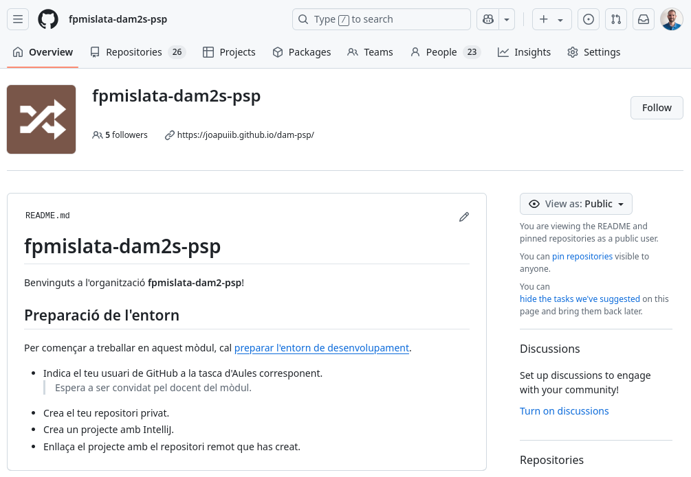
        /// shadow-figure-caption
        Organització [`fpmislata-dams2-psp`](https://github.com/fpmislata-dams2-psp) a GitHub
        ///

1. __Configurar els permisos dels :octicons-people-16: membres de l'organització com a *No permission*__.

    > D'aquesta manera, els estudiants no podran veure els repositoris privats
    > d'altres companys de classe.

    ??? picture "Permisos de l'organització"
        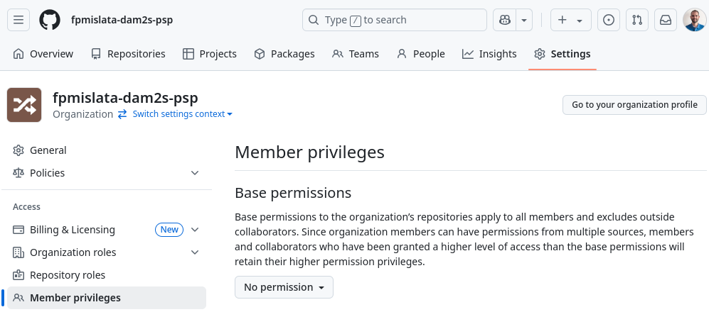
        /// shadow-figure-caption
        Permisos de la organització
        ///

1. __Convidar els estudiants a la :octicons-organization-16: organització__.

    > Els estudiants han d'acceptar la invitació, que rebran per correu electrònic,
    > per tal de poder accedir a la organització.

    ??? picture "Estudiants com a membres de l'organització"
        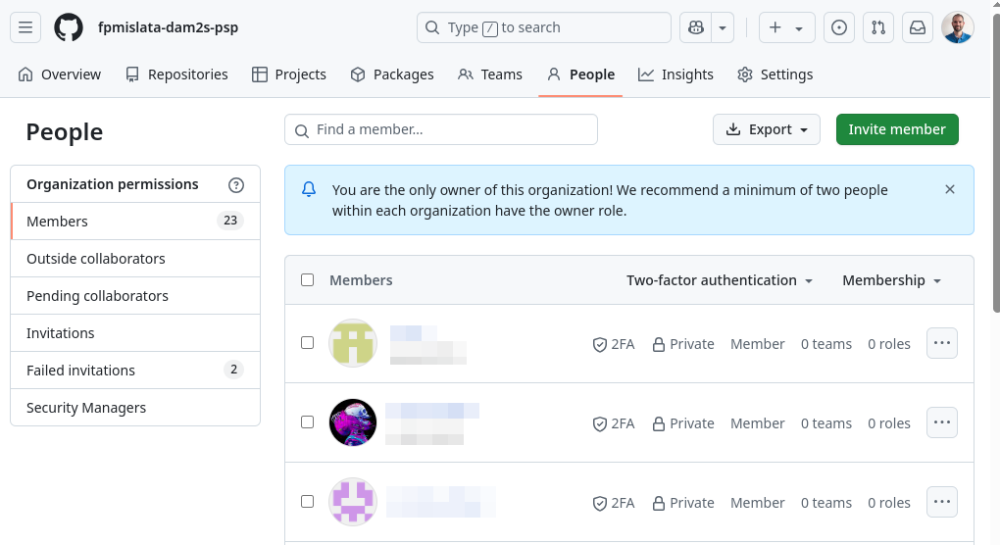
        /// shadow-figure-caption
        Estudiants com a membres de l'organització
        ///

1. Indicar a __cada estudiant que s'ha de crear un :octicons-repo-locked-16: repositori privat__.

    > Hem de decidir quants repositoris privats han de crear els estudiants al llarg
    > del curs acadèmic.
    >
    > Personalment, jo els demane que creen __un únic repositori__ que utilitzaran durant tot
    > el curs, amb la nomenclatura `{Cognom}{Nom}-{modul}`.
    >
    > - `PuigcerverJoan-ED`
    > - `PuigcerverJoan-PSP`
    >
    > No obstant això, també pot ser interessant crear diferents repositoris (un per cada tasca o projecte).
    > En aquest cas, cal tindre en compte que el volum de repositoris en l'organització augmentarà considerablement.

    ??? picture "Repositoris dels estudiants de l'organització"
        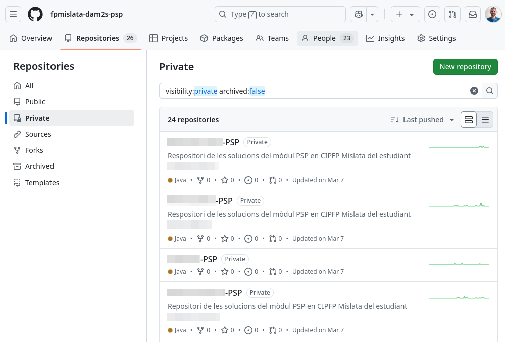
        /// shadow-figure-caption
        Repositoris dels estudiants de l'organització
        ///

1. Com a docent, __crear els :octicons-repo-16: repositoris públics__ amb solucions o exemples
    que es consideren necessaris.

    > Personalment, m'agrada crear un repositori equivalent al que tenen els estudiants, sobre
    > el qual vaig resolent els exercicis que fem a classe i on vaig publicant les solucions
    > al llarg del curs.

    > El repositori `.github` és un repositori especial, que s'utilitza per definir el `profile/README.md`
    > que apareix a la pàgina principal de l'organització.

    ??? picture "Repositoris públics del professorat de l'organització"
        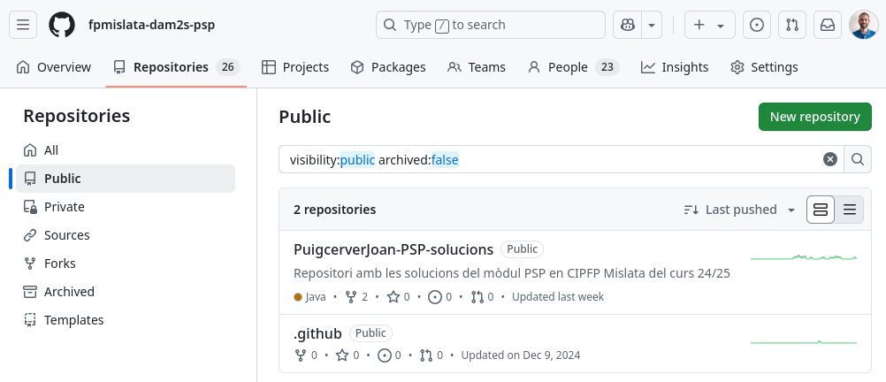
        /// shadow-figure-caption
        Repositoris públics del professorat de l'organització
        ///


### Treball en grup
En aquest cas, cada grup d'estudiants treballa en un mateix projecte i realitza
les tasques sobre el mateix repositori.

1. __Crear una :octicons-organization-16: organització__ a :simple-github: GitHub.

    > Personalment, m'agrada crear una organització per cada grup i mòdul professional
    > amb la nomenclatura `{centre}-{grup}-{modul}`.
    >
    > - `fpmislata-daw1-projecte`

    ??? tip "Perfil de l'organització"
        Pots afegir el repositori públic `.github` i configurar el fitxer `profile/README.md`
        per definir el perfil de l'organització.

        [:octicons-link-external-16: Adding a public organization profile README](https://docs.github.com/en/organizations/collaborating-with-groups-in-organizations/customizing-your-organizations-profile#adding-a-public-organization-profile-readme) – :simple-github: GitHub Docs

    ??? picture "Organització `fpmislata-daw1-projecte` a GitHub"
        
        /// shadow-figure-caption
        Organització [`fpmislata-daw1-projecte`](https://github.com/fpmislata-daw1-projecte) a GitHub
        ///

1. __Configurar els permisos dels :octicons-people-16: membres de l'organització com a *No permission*__.

    > D'aquesta manera, els estudiants no podran veure els repositoris privats
    > d'altres companys de classe.

    ??? picture "Permisos de l'organització"
        
        /// shadow-figure-caption
        Permisos de la organització
        ///

1. __Convidar els estudiants a la :octicons-organization-16: organització__.

    > Els estudiants han d'acceptar la invitació, que rebran per correu electrònic,
    > per tal de poder accedir a la organització.

    ??? picture "Estudiants com a membres de l'organització"
        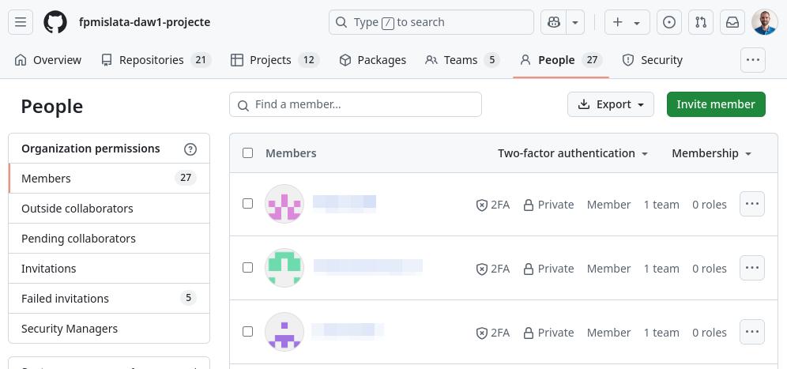
        /// shadow-figure-caption
        Estudiants com a membres de l'organització
        ///

1. __Convidar a la resta de docents a la :octicons-organization-16: organització__ com a __*Owner*__.

    > Els docents han d'acceptar la invitació, que rebran per correu electrònic.
    >
    > En aquest cas, també tindran accés a tots els repositoris privats
    > dels estudiants.

    ??? picture "Docents com a propietaris de l'organització"
        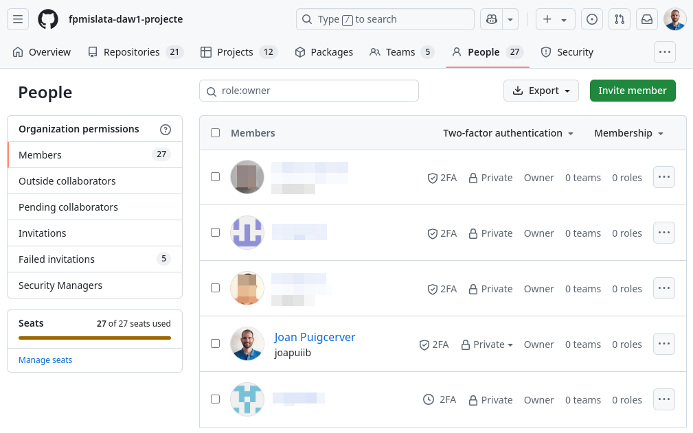
        /// shadow-figure-caption
        Docents com a propietaris de l'organització
        ///


1. __Crear un :octicons-people-16: equip__ per a cada grup d'estudiants
    i afegir els estudiants a l'equip.

    !!! info
        La creació de :octicons-people-16: l'equip, el :octicons-repo-locked-16: repositori privat
        i el :octicons-table-16: projecte pot ser realitzada per part del professorat
        o per part d'un dels estudiants del grup.

    ??? picture "Equips dels estudiants dins de l'organització"
        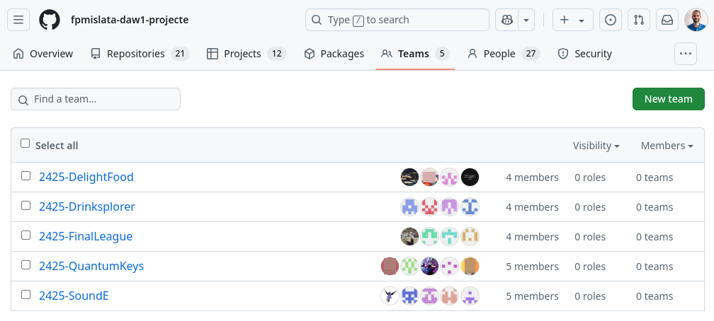
        /// shadow-figure-caption
        Equips dels estudiants dins de l'organització
        ///

1. __Crear un :octicons-repo-locked-16: repositori privat__ per a cada grup d'estudiants
    i __afegir :octicons-people-16: l'equip creat anteriorment__ com a col·laborador.

    ??? picture "Repositoris dels projectes a l'organització"
        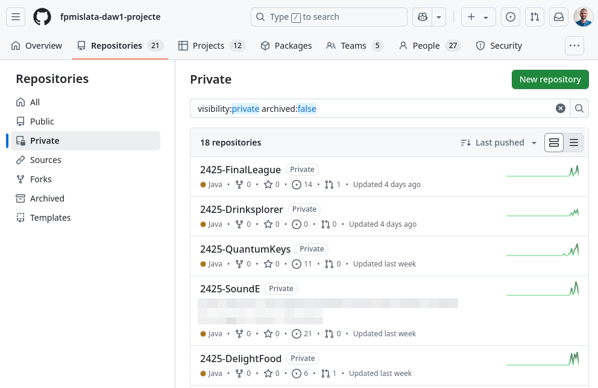
        /// shadow-figure-caption
        Repositoris dels projectes a l'organització
        ///
    
        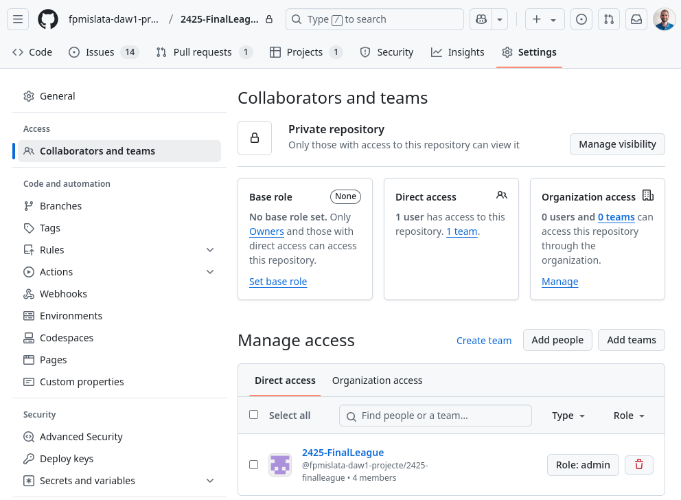
        /// shadow-figure-caption
        Assignació a l'equip com col·laboradors del repositori
        ///

1. __Crear un :octicons-table-16: projecte__ per cada grup, on poden __organitzar les tasques
    com a :octicons-issue-opened-16: incidències__.

    ??? picture "Projectes per gestionar les tasques"
        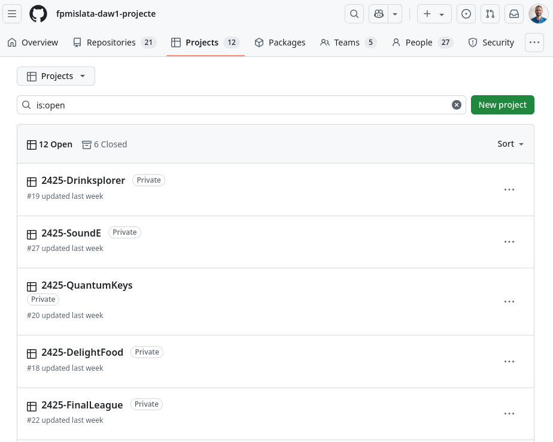
        /// shadow-figure-caption
        Projectes per gestionar les tasques
        ///
    
        
        /// shadow-figure-caption
        Projecte amb la planificació de tasques
        ///

1. Com a docent, __crear els :octicons-repo-16: repositoris públics__ amb solucions, exemples
    o plantilles que es consideren necessaris.

    > En aquest cas, hem creat els següents repositoris públics:
    >
    > - `.github` – Repositori especial per a la configuració del perfil de l'organització.
    > - `projecte-daw1` – Documentació del projecte.
    > - `projecte-template` – Plantilla del projecte.

    ??? picture "Repositoris públics de l'organització"
        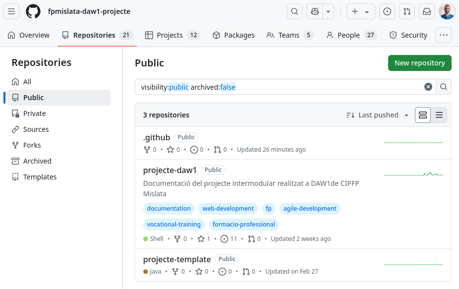
        /// shadow-figure-caption
        Repositoris públics de l'organització
        ///

A partir d'aquest punt, els equips de treball poden treballar de manera autònoma
i gestionar les seues tasques dins d'un únic projecte.
Per poder treballar de manera col·laborativa sobre el mateix repositori,
és important que facen un bon ús d'una de les [[estrategies]].

A més, l'ús de :simple-github: GitHub és independent de la metodologia
de treball que s'aplique a l'aula, com per exemple,
metodologies àgils com __Scrum__ o __Kanban__.

*[DAW]: Desenvolupament d'Aplicacions Web

!!! example "Exemple real aplicat en un projecte intermodular a 1r de DAW amb Scrum"

    Amb els estudiants de 1r curs de __Desenvolupament d'Aplicacions Web (DAW)__,
    hem estat treballant en un __projecte intermodular__ on es desenvolupa una
    __aplicació web__ de temàtica lliure. El projecte es porta a terme en grups
    de 4-5 estudiants i es treballa amb la metodologia àgil __Scrum__.

    Cada __:octicons-people-16: equip__ gestiona les tasques amb un __:octicons-table-16: projecte__,
    enllaçat a un __:octicons-repo-locked-16: repositori privat__.

    Es segueix la següent __estratègia de ramificació__:

    - Utilització de les __:octicons-git-branch-16:__ branques `develop` i `main`.
    - Utilització de les __:octicons-git-branch-16:__ branques `feature` per a cada tasca.
    - __:octicons-git-pull-request-16:__ _Pull Requests_ per a incorporar
      les __:octicons-git-branch-16:__ branques `feature` a la branca `develop`.

        - Enllaçar les __:octicons-issue-opened-16: incidències__ relacionades.
        -  Habilitar les __:octicons-eye-16: revisions__ per part dels companys.
        -  Configurar __:octicons-play-16: Actions__ per executar les proves automàticament
           abans de tancar la :octicons-git-pull-request-16: _Pull Request_.
        -  `merge --squash` per fusionar les :octicons-git-pull-request-16: _Pull Requests_.

    > _Podeu trobar més informació a [:fontawesome-solid-people-group: Projecte Intermodular DAW1](https://fpmislata-daw1-projecte.github.io/projecte-daw1/) – CIPFP Mislata._


### Lliurament de tasques
En qualsevol dels casos, els estudiants són els propietaris dels seus
repositoris i poden fer canvis sobre el seu contingut en qualsevol moment,
fins i tot després del termini de lliurament de la tasca.

Per tant, és important establir un __mecanisme de lliurament de tasques__,
per poder revisar el __treball que els estudiants han lliurat, independentment
si després l'han modificat__.

L'opció més senzilla és crear una __:octicons-tag-16: etiqueta__
o un __:material-tray-arrow-up: llançament (_release_)__ per identificar
el __:octicons-git-commit-16: commit__ en el qual es troba la versió
del treball que es vol lliurar.

??? picture "Etiquetes amb els lliuraments"
    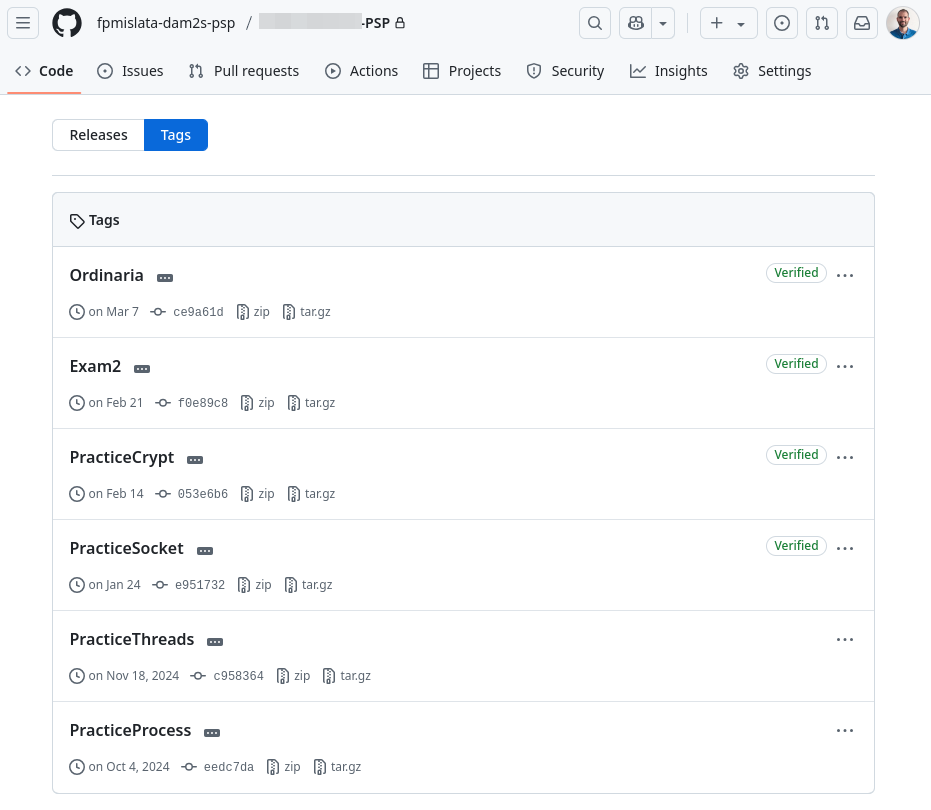
    /// shadow-figure-caption
    Etiquetes amb els lliuraments
    ///

El professorat, podrà accedir al repositori privat de l'estudiant
i situar-se en aquesta versió per tal de revisar el treball lliurat.

> Es recomana utilitzar __una :octicons-tag-16: etiqueta anotada__
> per poder comprovar la data en la qual s'ha creat.

Un altre aspecte a tindre en compte és que,
si es delega la creació dels repositoris privats als estudiants,
tenen la possibilitat d'esborrar-lo i podrien perdre tot el treball realitzat,
dificultant la revisió del treball lliurat en una reclamació posterior.

Per aquest motiu, personalment m'agrada demanar-los que lliuren
el codi de la tasca de manera comprimida a la __plataforma educativa oficial (Aules)__,
indicant l'enllaç al seu repositori.

??? picture "Lliurament d'una tasca a Aules"
    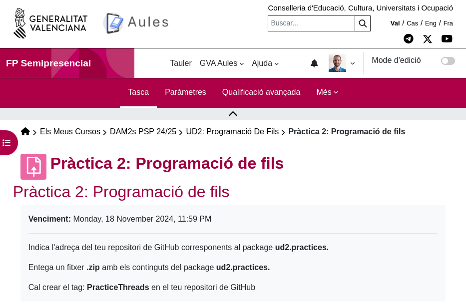
    /// shadow-figure-caption
    Definició de la tasca a Aules
    ///

    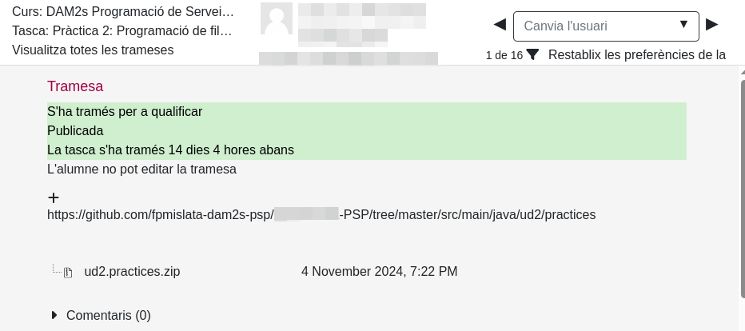
    /// shadow-figure-caption
    Lliurament d'un estudiant a Aules
    ///

> En la pràctica, no revise el codi lliurat a la tasca d'Aules i
> el consulte directament en el :octicons-repo-locked-16: repositori privat.
>
> No obstant això, és cert que de vegades els estudiants
> han tingut algun problema amb :simple-git: Git i gràcies a aquest _backup_
> els he pogut avaluar.

## Gestió de l'organització
Un dels principals reptes d'aquesta proposta és la gestió dels membres i repositoris
de l'organització:

- __Gestió dels membres__: :simple-github: GitHub no proporciona una manera senzilla
    de convidar i gestionar els membres de l'organització
    en massa.

- __Gestió dels repositoris de l'alumnat__: El nombre de repositoris
    de l'alumnat pot ser molt elevat i gestionar-los individualment
    pot ser complicat.

Per aquesta raó, s'ha desenvolupat __[`ghot`][ghot] (GitHub Organization Tools)__,
una eina de línia de comandes que permet gestionar els membres i repositoris
d'una organització de manera senzilla i ràpida.

Aquesta eina permet realitzar les següents accions de manera massiva:

- Convidar i eliminar membres de l'organització.
- Crear, eliminar, clonar i actualitzar (`pull`) repositoris.
- Crear incidències als repositoris.

!!! docs
    Podeu trobar la informació sobre la instal·lació i ús de `ghot` a la documentació:
    [:octicons-link-external-16: GitHub Organization Tools][ghot-docs]

!!! warning
    `ghot` és una eina en __estat experimental__.
    Vos recomane que executeu les ordres amb l'opció `--dry` primer
    per verificar que tot funciona correctament.

    A més, si trobeu algun error o teniu alguna proposta de millora,
    podeu indicar-ho a la secció d'[:octicons-issue-opened-16: Issues del repositori de `ghot`][ghot-issues].

[ghot-issues]: https://github.com/joapuiib/github-organization-tools/issues


!!! important
    No és necessari fer ús de `ghot` per aplicar aquesta proposta.
    Totes les accions poden ser realitzades manualment.

    
[ghot]: https://github.com/joapuiib/github-organization-tools
[ghot-docs]: https://joapuiib.github.io/github-organization-tools/

??? example "Convidar a l'alumnat a l'organització mitjançant `ghot`"
    El primer pas és crear un fitxer `estudiants.csv`,
    el qual ha segut exportat de la plataforma educativa Aules.

    ```csv
    Nom,Cognoms,username
    ADA,LOVELACE,adalovelace,
    "ALAN MATHISON",TURING,alanturing,
    ```

    > - He eliminat les columnes amb el correu electrònic i el grup.
    > - He afegit la columna `username`, on es recull el nom d'usuari de cada estudiant.

    A continuació, he configurat l'eina `ghot` per tal de poder
    de definir les dades de cada estudiant:

    - Un identificador `id` amb el format `{cognom}.{nom}`, en minúscules.
    - Un `username` amb el nom d'usuari de cada estudiant.
    - Un `repo` amb el format `{Cognom}{Nom}-ED`, on `ED` és el mòdul professional.

    ```bash
    ghot config csv.pattern.id "{f0.replace(' ', '.').lower()}.{f1.replace(' ', ',').lower()}"
    ghot config csv.pattern.username "{f2}"
    ghot config csv.pattern.repo "{f0.title().replace(' ', '')}{f1.title().replace(' ', '')}-ED"
    ```

    Per últim, ja podem:

    - Convidar els estudiants a l'organització amb `ghot user invite`.
    - Crear els repositoris privats amb `ghot repo create`.
    - Convidar els estudiants als repositoris corresponents amb `ghot repo invite`.

    !!! recommend "Recomanació"
        És recomanable executar les ordres amb l'opció `--dry` per tal de
        comprovar prèviament que tot funciona correctament.

    ```shellconsole
    joapuiib@fp:~ $ ghot user invite --dry fpmislata-daw1-ed estudiants.csv
    Total members: 1
    Pending invitations: 0
    ada.lovelace: Invitation sent to 'adalovelace' (dry).
    alan.mathison.turing: Invitation sent to 'alanturing' (dry).

    joapuiib@fp:~ $ ghot repo create --dry --private fpmislata-daw1-ed estudiants.csv
    ada.lovelace: Repository 'fpmislata-daw1-ed/AdaLovelace-ED' created (private) (dry).
    alan.mathison.turing: Repository 'fpmislata-daw1-ed/AlanMathisonTuring-ED' created (private) (dry).

    joapuiib@fp:~ $ ghot repo invite --dry fpmislata-daw1-ed estudiants.csv
    ada.lovelace: User 'adalovelace' is not a member of the organization.
    alan.mathison.turing: User 'alanturing' is not a member of the organization.
    ```
    > `ghot repo invite` no funciona correctament en aquest cas perquè
    > les comandes prèvies no s'han executat realment i els estudiants no són membres
    > de l'organització.
